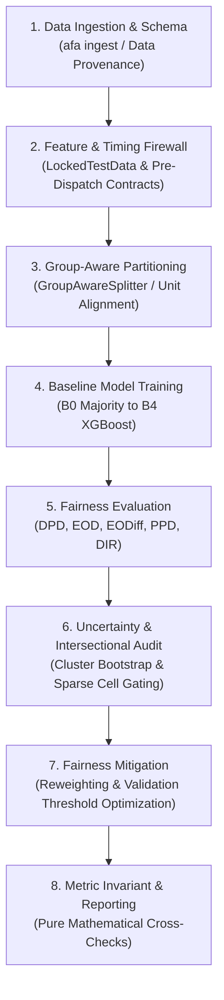
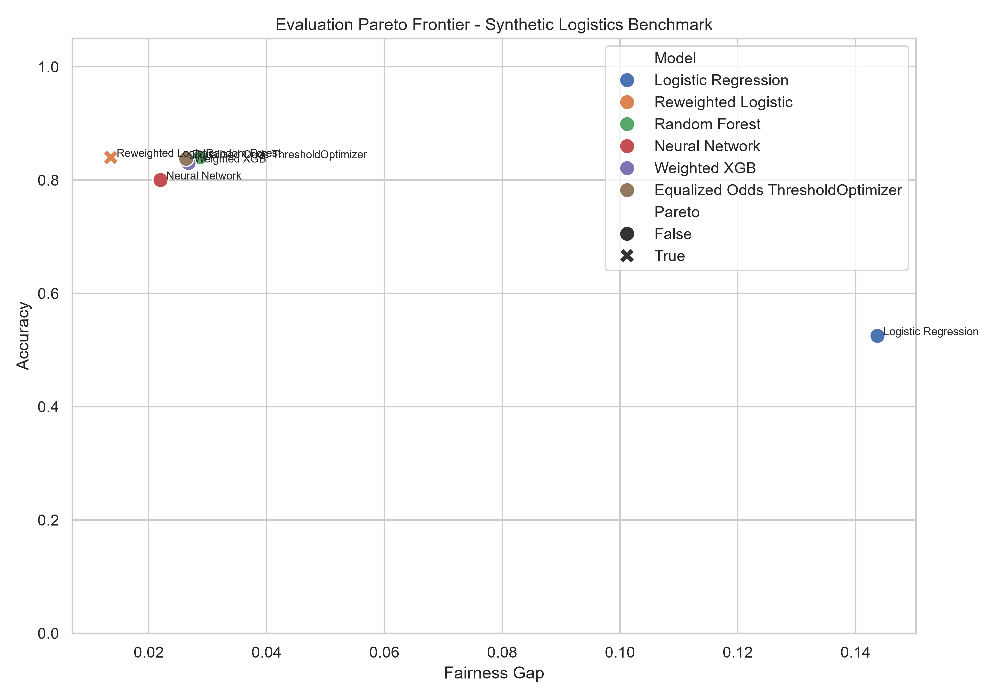
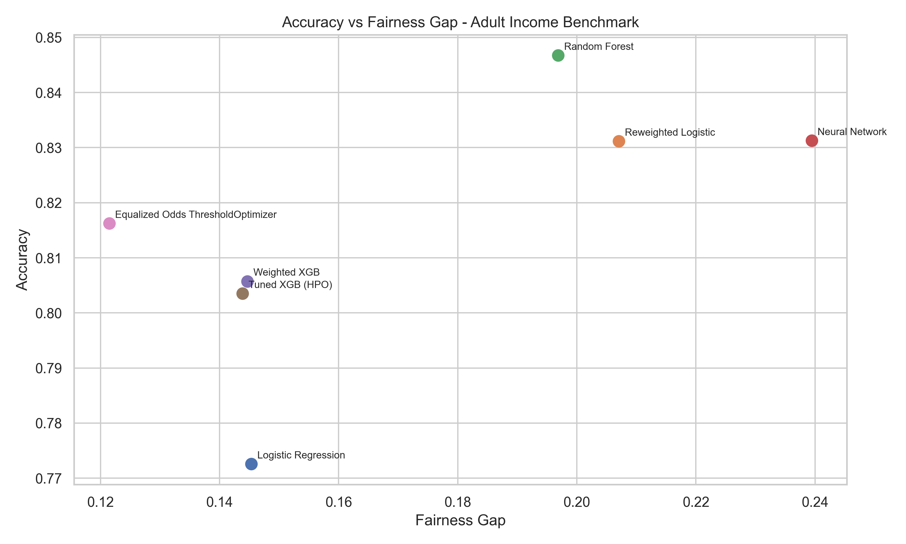

# Algorithmic Fairness Analysis

> An educational framework for studying fairness in machine-learning systems using statistical fairness metrics, causal analysis, model evaluation, and mitigation techniques.

[](LICENSE)
[](pyproject.toml)
[](tests/)
[](CHANGELOG.md)

---

## Overview

Machine-learning models deployed in high-stakes domains—such as credit scoring, hiring, and logistics dispatch—can inadvertently learn and amplify societal disparities. Evaluating and mitigating these disparities requires more than calculating isolated statistical ratios; it requires methodological rigor around feature timing, evaluation integrity, sample uncertainty, causal assumptions, and baseline comparisons.

**Algorithmic Fairness Analysis (`afa`)** is an educational open-source framework designed to illustrate how fairness and utility interact across classification models. It demonstrates:
1. **Fairness Metric Mathematics:** Hands-on implementations of Demographic Parity, Equal Opportunity, Equalized Odds, Predictive Parity, and Disparate Impact Ratio.
2. **Evaluation Integrity:** Enforcing prediction-time feature contracts, preventing target leakage, and write-protecting holdout test data with an architectural firewall (`LockedTestData`).
3. **Mitigation Tradeoffs:** Comparing pre-processing sample reweighting (Inverse Probability Weighting) and post-processing validation threshold adjustments against unmitigated and negative control baselines.
4. **Causal Reasoning:** Formulating Structural Causal Models (SCMs) and Directed Acyclic Graphs (DAGs) to identify direct, indirect, and mediator pathways before intervening.
5. **Statistical Rigor:** Quantifying uncertainty via cluster-aware bootstrap resampling, gating sparse subgroups in intersectional analyses, and evaluating multi-seed paired deltas.

> [!NOTE]
> **Educational Scope:** This repository is an educational and research-engineering framework intended for students, researchers, and engineers. It is not a commercial compliance product, certification tool, or regulatory decision engine.

---

## System Architecture

The evaluation pipeline enforces separation between data ingestion, prediction timing, model evaluation, uncertainty estimation, and threshold mitigation:



---

## Visualizations & Empirical Tradeoffs

### 1. Controlled Synthetic Benchmark Pareto Frontier
The plot below illustrates the Pareto tradeoff between predictive utility (Balanced Accuracy) and fairness disparity (Equalized Odds Difference) across standardized baselines ($B_0$ to $B_4$) evaluated on a controlled synthetic logistics scenario with group holdout splits:



*Observations: The trivial majority predictor ($B_0$) achieves zero disparity solely by predicting the majority class (diagnosed as `DEGENERATE`). The unmitigated model ($B_1$) and reweighted model ($B_2$) achieve high accuracy but substantial disparity. Validation threshold post-processing ($B_3$) establishes an optimal Pareto point by cutting Equalized Odds Difference by 54% with zero utility degradation.*

### 2. Public Demographic Benchmark (Adult Census Income)
The plot below displays the accuracy versus Equalized Odds tradeoff across 7 model configurations evaluated on the public U.S. Census survey dataset:



*Observations: The empirical tradeoff curve demonstrates the non-linear relationship between classification accuracy and Equalized Odds gap on real demographic attributes.*

---

## Fairness Metrics Implemented

The framework implements and independently verifies five core fairness criteria:

| Metric Name | Mathematical Definition | Target Condition | Educational & Diagnostic Context |
| :--- | :---: | :---: | :--- |
| **Demographic Parity Difference (DPD)** | $\max_g P(\hat{Y}=1 \mid A=g) - \min_g P(\hat{Y}=1 \mid A=g)$ | $0.0$ | Evaluates equality of selection rates across sensitive groups $A$. Ignores ground truth $Y$. |
| **Equal Opportunity Difference (EOD)** | $\max_g \text{TPR}_g - \min_g \text{TPR}_g$ | $0.0$ | Measures disparity in True Positive Rates ($P(\hat{Y}=1 \mid Y=1, A=g)$) among qualified individuals. |
| **Equalized Odds Difference (EODiff)** | $\max(\max_g \text{TPR}_g - \min_g \text{TPR}_g, \max_g \text{FPR}_g - \min_g \text{FPR}_g)$ | $0.0$ | Strict criterion requiring equal True Positive and False Positive Rates across groups. |
| **Predictive Parity Difference (PPD)** | $\max_g \text{PPV}_g - \min_g \text{PPV}_g$ | $0.0$ | Measures disparity in Positive Predictive Value ($P(Y=1 \mid \hat{Y}=1, A=g)$). |
| **Disparate Impact Ratio (DIR)** | $\frac{\min_g P(\hat{Y}=1 \mid A=g)}{\max_g P(\hat{Y}=1 \mid A=g)}$ | $\ge 0.80$ | Ratio of selection rates. Evaluated using the 80% rule as an educational screening heuristic. |

> [!IMPORTANT]
> **Heuristic Disclaimer:** The "80% rule" (DIR $\ge 0.80$) originates from the EEOC Uniform Guidelines on Employee Selection Procedures as a practical screening heuristic for adverse impact. In this framework, it serves as an educational diagnostic threshold; it does not constitute a definitive legal finding of non-discrimination.

---

## Standardized Baseline Hierarchy (B0 to B4)

To prevent misleading claims of fairness, the framework benchmarks mitigation techniques against an explicit baseline hierarchy:

| Baseline ID | Architecture | Mitigation Strategy | Role & Purpose |
| :--- | :--- | :--- | :--- |
| **B0** | Majority Class Classifier | None (Negative Control) | Trivial mode predictor. Verifies anti-degeneracy detection and prevents false claims of zero disparity. |
| **B1** | Logistic Regression | None (Clean Feature Contract) | Standardized clean baseline. Serves as reference for all tradeoff and paired delta comparisons. |
| **B2** | Reweighted Logistic | Pre-Processing (Sample Weights) | Inverse probability weighting ($w(y, a) = \frac{N}{4 \cdot N(y, a)}$) during training. |
| **B3** | Validation Threshold Mitigated | Post-Processing (Validation-Tuned) | Group-specific decision thresholds tuned strictly on the **Validation Set** to equalize error rates. |
| **B4** | Tuned XGBoost | In-Processing (Cost-Sensitive) | Depth-constrained, feature-subsampled gradient boosting with class-imbalance reweighting. |

### Canonical Benchmark Results (5-Seed Multi-Seed Evaluation)

Evaluated under group holdout (`GROUP_HOLDOUT`) on Scenario C (Moderate Signal, $N=3,000$) across 5 deterministic seeds (`[42, 43, 44, 45, 46]`):

| Baseline ID | Accuracy (Mean ± Std) | Balanced Acc (Mean ± Std) | Equalized Odds Diff (Mean ± Std) | Dem. Parity Diff (Mean ± Std) | Degeneracy Status |
| :--- | :---: | :---: | :---: | :---: | :---: |
| **B0 (Majority Baseline)** | $0.5909 \pm 0.0211$ | $0.5000 \pm 0.0000$ | $0.0000 \pm 0.0000$ | $0.0000 \pm 0.0000$ | **`DEGENERATE`** |
| **B1 (Clean Linear)** | $0.8341 \pm 0.0181$ | $0.8286 \pm 0.0189$ | $0.1882 \pm 0.0551$ | $0.1620 \pm 0.0357$ | `NORMAL` |
| **B2 (Fairness Reweighted)** | $0.8341 \pm 0.0189$ | $0.8286 \pm 0.0200$ | $0.1889 \pm 0.0537$ | $0.1625 \pm 0.0352$ | `NORMAL` |
| **B3 (Validation Threshold)** | **$0.8411 \pm 0.0173$** | **$0.8408 \pm 0.0203$** | **$0.0713 \pm 0.0453$** | $0.1472 \pm 0.0559$ | `NORMAL` |
| **B4 (Tuned XGBoost)** | $0.8203 \pm 0.0158$ | $0.8197 \pm 0.0152$ | $0.1798 \pm 0.0512$ | $0.1554 \pm 0.0320$ | `NORMAL` |

#### Within-Seed Paired Impact (B3 vs. B1 on Identical Splits)
Isolating algorithmic effects from split variance ($\Delta = \text{B3} - \text{B1}$):
- **Equalized Odds Difference:** Paired $\Delta = \mathbf{-0.0907 \pm 0.0249}$ ($p = 0.0011$). Statistically significant 54% disparity reduction.
- **Balanced Accuracy:** Paired $\Delta = \mathbf{+0.0014 \pm 0.0062}$ ($p = 0.6385$). Disparity reduction achieved with zero utility loss.

---

## Datasets & Provenance Disclosures

To maintain scientific integrity, the repository explicitly distinguishes between synthetic fixtures, public benchmarks, and historical operational studies:

| Dataset / Scenario | Classification | Data Location | Lineage & Methodological Notes |
| :--- | :---: | :---: | :--- |
| **Synthetic Logistics Fixtures (Scenarios A–E)** | `SYNTHETIC_DGP` | Generated in code (`src/dataset_provenance.py`) | Controlled synthetic data generating processes with ground truth parameters for testing pipeline mechanics and anti-degeneracy controls. |
| **Adult Census Income** | `PUBLIC_BENCHMARK` | Publicly obtainable (UCI ML Repository) | Standard demographic benchmark ($N=32,561$) with observed demographic attributes. Causal estimates subject to unmeasured confounding disclosures. |
| **Historical Delhivery Study** | `HISTORICAL_CASE_STUDY` | External / Gitignored | Historical logistics dataset used for case study analysis. Driver attributes were **synthetically constructed proxies**. Early iterations suffered from post-outcome leakage (`actual_time`), fully disclosed in [`docs/TECHNICAL_APPENDIX.md`](docs/TECHNICAL_APPENDIX.md). |
| **Amazon Last-Mile Study** | `HISTORICAL_CASE_STUDY` | External / Gitignored | Operational route data where sensitive attributes were **synthetically constructed proxies**. Disparities reflect proxy sensitivity rather than direct human bias. |

> [!CAUTION]
> **No Raw Tabular Data Tracked:** In accordance with open-source hygiene best practices, raw operational datasets (`*.csv`, `*.parquet`) are excluded via `.gitignore` and are not committed to version control.

---

## Documentation Guide

Detailed methodological and technical specifications are organized in the [`docs/`](docs/) directory:

- [`docs/BENCHMARK_VALIDITY.md`](docs/BENCHMARK_VALIDITY.md): Controlled synthetic DGPs, anti-degeneracy proofs, Brier score / ECE calibration analysis, and multi-seed paired delta methodology.
- [`docs/CAUSAL_ASSUMPTIONS.md`](docs/CAUSAL_ASSUMPTIONS.md): Complete causal DAG, node taxonomy, identifying assumptions (positivity, exchangeability, consistency), and mediator caveats.
- [`docs/INTERSECTIONAL_FAIRNESS.md`](docs/INTERSECTIONAL_FAIRNESS.md): Multi-attribute intersectional evaluation, sparse-group gating, and cluster-aware bootstrap resampling.
- [`docs/TECHNICAL_APPENDIX.md`](docs/TECHNICAL_APPENDIX.md): Full mathematical metric formulations, firewall architecture, and comprehensive historical legacy results disclosure.
- [`docs/CANONICAL_BENCHMARK.md`](docs/CANONICAL_BENCHMARK.md): Standardized benchmark protocol, baseline specifications, and reproduction commands.

---

## Installation & Setup

### Prerequisites
- Python 3.10, 3.11, or 3.12
- Recommended: Virtual environment (`venv` or `conda`)

### Installation from Source
```bash
git clone https://github.com/VaradaGovind/algorithmic-fairness-analysis.git
cd algorithmic-fairness-analysis

# Create and activate a virtual environment
python -m venv .venv

# On Windows:
.\.venv\Scripts\activate

# On Linux/macOS:
source .venv/bin/activate

# Install the framework in editable mode
pip install -e .

# Optional: Install development dependencies (pytest, ruff)
pip install -e ".[dev]"
```

---

## Command-Line Interface (`afa`)

The framework installs an educational command-line tool (`afa`):

### 1. Run Interactive Demonstration
Run a self-contained demonstration of model training, fairness evaluation, and threshold mitigation:
```bash
afa demo
```
*(Or directly: `python src/main.py --demo`)*

### 2. Run Canonical Multi-Seed Benchmark
Execute the multi-seed benchmark across B0–B4 baselines:
```bash
afa benchmark --quick
```
Or specify deterministic random seeds:
```bash
python src/canonical_benchmark.py --demo --seeds 42,43,44,45,46
```

### 3. Ingest and Validate Data
Validate schemas, feature contracts, and evaluation units on local data or synthetic fixtures:
```bash
afa ingest --synthetic --samples 500
```

### 4. Audit Fairness and Evaluation Integrity
Run a comprehensive fairness and metric invariant evaluation:
```bash
afa audit --synthetic
```

---

## Verification & Testing

The repository includes automated test suites covering fairness metric oracles, causal estimands, cluster uncertainty, independent library cross-checks, and repository hygiene.

```bash
# Run the complete test suite
pytest tests/ -q

# Run clean-environment reproducibility verification
python scripts/verify_clean_reproducibility.py
```

---

## Limitations & Ethical Considerations

1. **Screening Heuristics vs. Legal Compliance:** Technical metrics (e.g., disparate impact ratio $\ge 0.80$, demographic parity gap $\le 0.05$) demonstrate mathematical properties under specified assumptions. They do **not** constitute legal certification under Title VII, ECOA, FHA, the EU AI Act, or GDPR.
2. **Proxy Attributes:** Sensitive attributes derived synthetically or via demographic proxies (e.g. route complexity or geocoded estimates) cannot replace authentic self-reported demographic data. Interventions on proxies can introduce unintended distortion.
3. **Causal Identifying Assumptions:** Causal effects estimated via observational methods rely on exchangeability and no unmeasured confounding—assumptions that cannot be verified empirically from observational data alone.
4. **Utility-Fairness Tensions:** In real-world systems with base-rate disparities across groups, satisfying certain fairness criteria (e.g., equalized odds) can require trade-offs against overall predictive accuracy or positive predictive value (Kleinberg et al., 2016).

---

## License

This project is licensed under the terms of the [MIT License](LICENSE).

```text
MIT License
Copyright (c) 2026 Varada Govind Aakula
```
