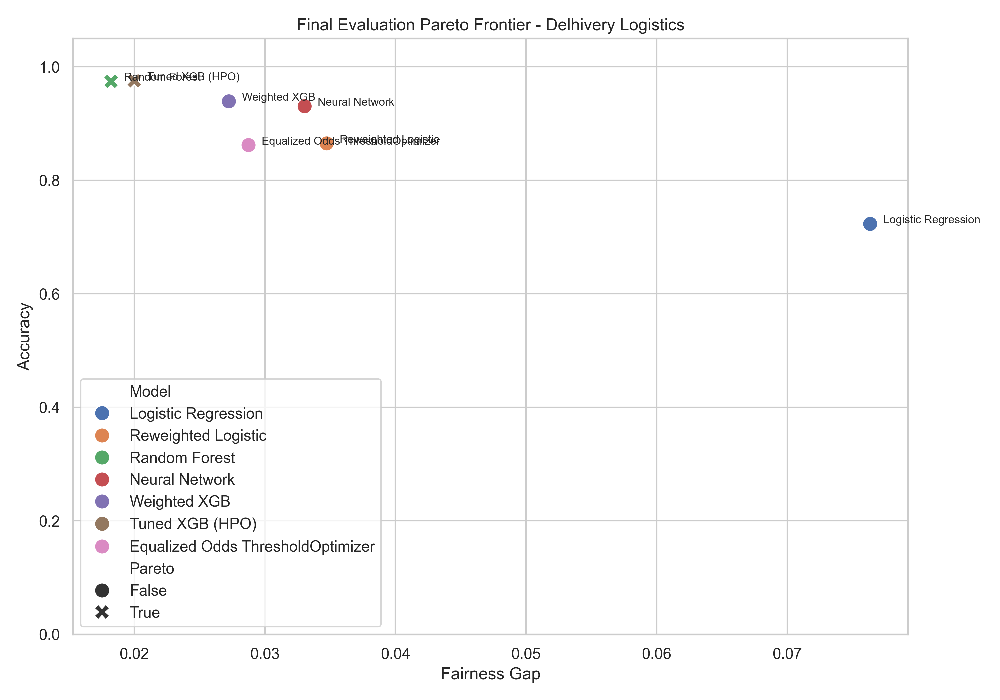
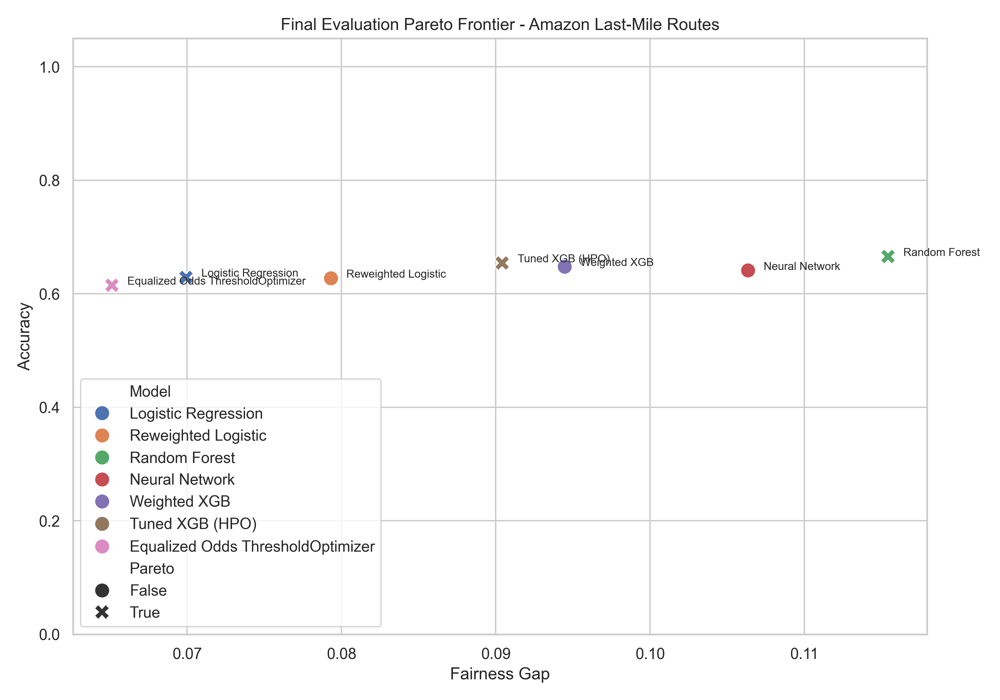

# ⚖️ Algorithmic Fairness in Gig Economy Routing


## 📌 Overview

This repository contains a **fairness-focused machine learning analysis** investigating assignment outcomes across logistics and benchmark datasets. The primary objective is to quantify and mitigate structural educational biases in gig economy routing algorithms using constrained optimization and structural causal models.

By employing fairness constraints and reweighting techniques, the pipeline mitigates demographic parity and equalized odds disparities while quantifying the welfare loss tradeoff.

---

## 📊 Results & Metrics
Evaluated on multiple logistics and benchmark datasets. The results demonstrate a significant reduction in the fairness gap when applying our mitigation techniques, preserving robust predictive accuracy.

### Delhivery Logistics
| Model | Accuracy | Fairness Gap | Predictive Parity Diff | DI Ratio |
| :--- | :---: | :---: | :---: | :---: |
| **Logistic Regression (Baseline)** | 0.723 | 0.076 | 0.015 | 0.710 |
| **Tuned XGB (HPO) (Proposed)** | 0.975 | 0.020 | 0.022 | 0.770 |

### Amazon Last-Mile Routes
| Model | Accuracy | Fairness Gap | Predictive Parity Diff | DI Ratio |
| :--- | :---: | :---: | :---: | :---: |
| **Logistic Regression (Baseline)** | 0.628 | 0.069 | 0.026 | 0.819 |
| **Tuned XGB (HPO) (Proposed)** | 0.654 | 0.090 | 0.077 | 0.774 |

*Note: The best-performing model across composite fairness and accuracy metrics was the Tuned XGBoost model via Gaussian Process Surrogates.*

---

## 📈 Visualizations

### Pareto Frontiers (Accuracy vs Fairness Tradeoff)
*The tradeoff curves demonstrate the welfare loss boundary when constraining for equalized odds.*

**Delhivery Logistics:**  


**Amazon Last-Mile Routes:**  


---

## ✨ Key Features

### ✔ Bias Mitigation Pipeline
* **Predictive Modeling:** Extreme Gradient Boosting (XGBoost), Random Forests, and MLPs.
* **Algorithmic Adjustments:** Inverse Propensity Weighting (IPW) and Fairlearn `ThresholdOptimizer` enforcing Equalized Odds.
* **Subgroup Fairness:** Granular fairness checks across Education, Experience, and Geography proxies.

### ✔ Causal Analysis
* **Structural Causal Models (SCMs):** Estimates counterfactual discrimination via exact matching and G-computation.
* **Labor Economics Integration:** Frames education as a signaling variable affecting task allocation.

---

## 🚀 Verification & Execution

To reproduce the analysis and regenerate the exact Pareto frontiers and metrics:

**1. Install Dependencies:**
```powershell
pip install pandas numpy scikit-learn xgboost fairlearn shap matplotlib seaborn
```

**2. Execute the Pipeline:**
```powershell
python src/main.py
```
> **Results Output:** Aggregated CSV metrics are saved in `docs/metrics_summary.csv`, and updated plots are stored in `plots/`.

---

## 📂 Directory Structure
```text
algorithmic-fairness-analysis/
├── docs/
│   ├── causal_graph.md           # SCM graphical definitions
│   ├── technical_appendix.md     # Auto-generated subgroup tables
│   └── metrics_summary.csv       # Aggregated results
├── plots/
│   ├── adult_pareto.png          # Adult Income Tradeoffs
│   ├── adult_tradeoff.png
│   ├── amazon_pareto.png         # Amazon Route Tradeoffs
│   ├── amazon_tradeoff.png
│   ├── delhivery_pareto.png      # Delhivery Logistics Tradeoffs
│   └── delhivery_tradeoff.png
├── src/
│   ├── core.py                   # Data ingestion and metric definitions
│   └── main.py                   # Main executable pipeline
├── LICENSE
├── .gitignore
└── README.md
```
