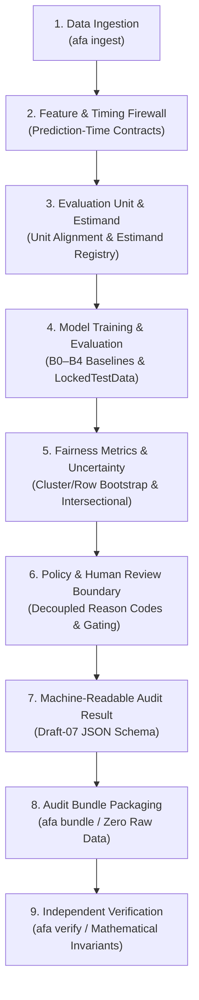

# Algorithmic Fairness Analysis

> An auditable fairness evaluation, mitigation, and verification framework for machine learning decision systems.

[](LICENSE)
[](pyproject.toml)
[](tests/)
[](scripts/verify_clean_reproducibility.py)
[](docs/RELEASE_CANDIDATE.md)

---

## Release & Evidence Status

> **Release-candidate engineering verification complete. Repository publication checks passed. External real-data validation has not been executed and remains pending authorized operational-data staging.**

| Dimension | Status | Evidence Boundary & Scope |
| :--- | :---: | :--- |
| **Engineering Verification** | **VERIFIED** | 209/209 automated unit/integration tests pass; CLI entry points and schema validation functional. |
| **Synthetic Reproducibility** | **VERIFIED** | 10/10 stages in `scripts/verify_clean_reproducibility.py` verify clean from scratch on controlled DGPs. |
| **Bundle Integrity Verification** | **VERIFIED** | Cryptographic SHA-256 fingerprinting, Draft-07 schema checks, and independent math invariant assertions. |
| **Publication Hygiene** | **VERIFIED** | Automated scanners confirm zero tracked credentials, zero tracked operational tabular data, and zero local paths. |
| **External Empirical Validation** | **PENDING** | Authentic customer operational data has not been staged or evaluated; recorded as `EXTERNAL_VALIDATION_PENDING`. |
| **Regulatory / Business Approval** | **HUMAN REVIEW REQUIRED** | Quantitative metric satisfaction does not constitute legal non-discrimination certification under Title VII, ECOA, FHA, or EU AI Act. |

*This framework has been internally verified against the repository's documented engineering and integrity test suite. It is not certified, legally compliant, independently audited, production-cleared for a specific customer, or externally validated.*

---

## What the Project Does

`algorithmic-fairness-analysis` provides a disciplined, audit-grade pipeline for evaluating algorithmic decision models:

- **Fairness Evaluation:** Computes standard parity metrics including demographic parity difference, equalized odds difference, predictive parity difference, and disparate impact ratio (Four-Fifths rule screening).
- **Prediction-Time Feature Controls:** Enforces strict feature contracts (`configs/benchmark_features.yaml`) prohibiting post-outcome realizations and target proxies.
- **Evaluation-Unit Semantics:** Distinguishes observation rows from decision units (e.g., individual trip segments vs. aggregated driver decisions) to avoid sample miscounts.
- **Estimand Handling:** Declares target populations and statistical estimands (`configs/evaluation_units.yaml`) to ensure policy comparisons evaluate well-defined quantities.
- **Uncertainty Estimation:** Computes non-parametric empirical percentile bootstrap confidence intervals with support for both row-level and cluster-aware resampling.
- **Intersectional Analysis:** Quantifies disparity gaps across multi-attribute intersections while guarding against sparse subgroup sample collapse.
- **Causal Analysis Support & Assumptions:** Includes baseline causal contrast estimation with documented identification assumptions and DAG structural disclosures.
- **Model Evaluation Firewall:** Architecturally isolates holdout evaluation data (`LockedTestData`) to prevent test-set tuning and feature contamination.
- **Policy Decision Gate:** Decouples statistical metric calculation from governance policy (`verify_policy_decision_gate`), mapping outcomes into a 4-tier taxonomy (`AUDIT_EXECUTION_STATUS`, `EVIDENCE_STATUS`, `MODEL_STATUS`, `POLICY_STATUS`).
- **Human-Review Boundaries:** Surfaces structured reason codes (`HumanReviewReasonCode`) with canonical alias normalization when statistical boundaries warrant human domain review.
- **Audit Bundles & Verification:** Packages configurations, results, and environment metadata into zero-raw-data audit bundles validated by an independent verifier (`verify_audit_bundle`).
- **Privacy & Security Boundary:** Forbids embedding raw records in exported bundles and scans for potential credential patterns.
- **Command-Line Interface:** Unified `afa` CLI with deterministic exit codes for CI/CD integration.

---

## Architecture



*Note: The architectural pipeline computes and verifies mathematical criteria; it does not determine legal compliance or statutory non-discrimination.*

---

## Command-Line Interface (CLI)

The framework installs a deterministic command-line tool (`afa`):

### 1. Ingest Data
Validate column schemas, unit mappings, and feature contracts:
```bash
afa ingest --file /path/to/staged_dataset.csv --dataset delhivery_logistics
```
Or run the synthetic self-check:
```bash
afa ingest --synthetic --samples 500
```

### 2. Execute Fairness Audit
Run an evaluation audit and produce a machine-readable JSON result:
```bash
afa audit --synthetic --confirmatory --output audit_result.json
```
Exit codes: `0` (Policy Passed), `1` (Policy Failed), `2` (Execution Blocked), `4` (Configuration Error).

### 3. Generate Audit Bundle
Package configuration, results, warnings, and environment metadata without raw data:
```bash
afa bundle --audit-result audit_result.json --output-dir release_bundle/
```

### 4. Verify Audit Bundle
Perform independent structural, cryptographic, invariant, and raw-data verification:
```bash
afa verify release_bundle/
```
Exit codes: `0` (Verification Succeeded), `3` (Verification Failed), `4` (Path Error).

---

## Verification Evidence

The repository has been verified using the following automated tools:

```text
========================================================================================
ENGINEERING VERIFICATION SUMMARY
========================================================================================
Automated Unit & Regression Tests:     209 / 209 PASSED (0 failures)
Clean-Environment Reproducibility:    10 / 10 STAGES PASSED (Exit code 0)
Independent Metric Oracle Tests:       PASSED (Calculated from first principles)
Reference Library Cross-Checks:       PASSED (Aligned with Fairlearn / scikit-learn)
Bundle Verification Checks:           PASSED (Independent mathematical invariants)
Publication Hygiene Scan:              PASSED (0 secrets, 0 tracked data, 0 local paths)
========================================================================================
```

*These results verify software engineering integrity, mathematical correctness of formulas, and pipeline robustness under controlled conditions.*

---

## Empirical Validation Boundary

- **No Authentic Customer Operational Data Evaluated:** This repository tracks zero proprietary customer datasets.
- **Synthetic DGP Execution:** Primary benchmark scenarios execute on mathematically controlled synthetic Data Generating Processes (DGPs) to test model behavior under known signal and leakage conditions.
- **Buyer Notice:** Synthetic performance numbers demonstrate software capabilities; they do **not** constitute empirical evidence of fairness or accuracy on genuine operational customer systems.
- **External Staging Pathway:** Evaluations on external operational data require verified staging outside Git version control via `ExternalDatasetAdapter` and remain pending client authorization (`EXTERNAL_VALIDATION_PENDING`).

---

## Dataset & Provenance Notes

| Dataset / Scenario | Classification | Lineage & Audit Notes |
| :--- | :---: | :--- |
| **Delhivery Logistics Benchmark** | `SYNTHETIC_PROXY` | Driver demographic records are not observed in the underlying data. Evaluated sensitive attributes are **synthetically constructed proxies** derived from route complexity. |
| **Amazon Last-Mile Benchmark** | `SYNTHETIC_PROXY` | Sensitive attributes are **synthetically constructed proxies**. Disparities reflect proxy sensitivity rather than human discrimination. |
| **Adult Census Income** | `PUBLIC_BENCHMARK` | Public U.S. Census reference benchmark. Real demographic traits observed; causal estimates subject to unmeasured confounding disclosures. |
| **Client Operational Data** | `EXTERNAL_PENDING` | Not staged; tracked as `EXTERNAL_VALIDATION_PENDING` per [`docs/EXTERNAL_VALIDATION_PENDING.md`](docs/EXTERNAL_VALIDATION_PENDING.md). |
| **Historical Legacy Single-Run** | `LEGACY_NONCOMPARABLE` | Historical runs containing post-outcome feature leakage (`actual_time`) are archived in [`docs/LEGACY_RESULTS_APPENDIX.md`](docs/LEGACY_RESULTS_APPENDIX.md) for audit traceability and must not be cited as valid baselines. |

---

## Documentation Map

- [`docs/RELEASE_CANDIDATE.md`](docs/RELEASE_CANDIDATE.md) — Release candidate specification, priority disposition table, and threat model.
- [`docs/FINAL_RELEASE_AUDIT.md`](docs/FINAL_RELEASE_AUDIT.md) — Comprehensive forensic verification report and Claim Eligibility Matrix.
- [`docs/EXTERNAL_VALIDATION_PENDING.md`](docs/EXTERNAL_VALIDATION_PENDING.md) — Protocol and record specification for external customer operational staging.
- [`docs/REAL_DATA_VALIDATION.md`](docs/REAL_DATA_VALIDATION.md) — Ingestion boundaries, unit validation, and empirical validation governance.
- [`docs/EVALUATION_INTEGRITY.md`](docs/EVALUATION_INTEGRITY.md) — Leakage prevention, prediction-time contracts, and firewall architecture.
- [`docs/CAUSAL_ASSUMPTIONS.md`](docs/CAUSAL_ASSUMPTIONS.md) — Causal identification assumptions, DAG structures, and parametric contrast limitations.
- [`docs/INTERSECTIONAL_FAIRNESS.md`](docs/INTERSECTIONAL_FAIRNESS.md) — Multi-attribute intersectional evaluation and sparse subgroup sample thresholds.
- [`docs/LEGACY_RESULTS_APPENDIX.md`](docs/LEGACY_RESULTS_APPENDIX.md) — Disclosure of legacy single-run results and contaminated baseline analyses.

---

## Installation

### Prerequisites
- Python >= 3.10
- Virtual environment recommended

### Installation from Source
```bash
git clone https://github.com/VaradaGovind/algorithmic-fairness-analysis.git
cd algorithmic-fairness-analysis
python -m venv .venv

# On Windows:
.\.venv\Scripts\activate

# On Linux/macOS:
source .venv/bin/activate

pip install -e .
```

### Install with Developer Dependencies
```bash
pip install -e ".[dev]"
```

---

## Testing & Reproducibility

### Run the Full Test Suite
```bash
pytest tests/ -q
```
*Expected: 209 passed.*

### Run the Clean-Environment Reproducibility Verification
```bash
python scripts/verify_clean_reproducibility.py
```
*Expected: 10/10 steps passed (Exit code 0).*

---

## License

This project is licensed under the terms of the [MIT License](LICENSE).

```text
MIT License
Copyright (c) 2026 Varada Govind Aakula
```

---

## Disclaimer

1. **Technical Evidence, Not Legal Advice:** Quantitative metrics (e.g., demographic parity difference $\le 0.05$, disparate impact ratio $\ge 0.80$) reflect technical satisfaction of mathematical definitions. They do **not** constitute legal certification or statutory compliance immunity under Title VII, ECOA, FHA, the EU AI Act, or other anti-discrimination laws.
2. **Human Governance Required:** Regulatory threshold interpretations, proxy appropriateness, and trade-offs between accuracy and disparity require qualified human legal and domain oversight.
3. **Pending Operational Validation:** All synthetic findings demonstrate software functionality; deployment to production environments requires customer-specific empirical staging and review.
