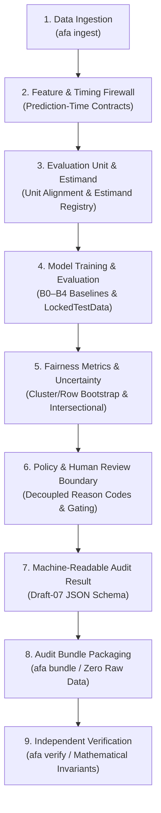

# Algorithmic Fairness Analysis

> An auditable fairness evaluation, mitigation, and verification framework for machine learning decision systems.

[](LICENSE)
[](pyproject.toml)
[](tests/)
[](scripts/verify_clean_reproducibility.py)
[](docs/RELEASE_CANDIDATE.md)

---

## Release & Evidence Status

> **Release-candidate engineering verification complete. Repository publication checks passed. External real-data validation has not been executed and remains pending authorized operational-data staging.**

| Dimension | Status | Evidence Boundary & Scope |
| :--- | :---: | :--- |
| **Engineering Verification** | **VERIFIED** | 209/209 automated unit/integration tests pass; CLI entry points and schema validation functional. |
| **Synthetic Reproducibility** | **VERIFIED** | 10/10 stages in `scripts/verify_clean_reproducibility.py` verify clean from scratch on controlled DGPs. |
| **Bundle Integrity Verification** | **VERIFIED** | Cryptographic SHA-256 fingerprinting, Draft-07 schema checks, and independent math invariant assertions. |
| **Publication Hygiene** | **VERIFIED** | Automated scanners confirm zero tracked credentials, zero tracked operational tabular data, and zero local paths. |
| **External Empirical Validation** | **PENDING** | Authentic customer operational data has not been staged or evaluated; recorded as `EXTERNAL_VALIDATION_PENDING`. |
| **Regulatory / Business Approval** | **HUMAN REVIEW REQUIRED** | Quantitative metric satisfaction does not constitute legal non-discrimination certification under Title VII, ECOA, FHA, or EU AI Act. |

*This framework has been internally verified against the repository's documented engineering and integrity test suite. It is not certified, legally compliant, independently audited, production-cleared for a specific customer, or externally validated.*

---

## Validation Snapshot

A summary of verified technical capabilities, benchmark performance, and safety controls observed on the current test suite and benchmark suite:

| Evaluation Area | Observed Metric / Result | Evidence Type | Source & Provenance |
| :--- | :---: | :---: | :--- |
| **Functional Correctness** | **209 / 209 tests passed** (100%) | Measured test suite | 15 test modules in [`tests/`](tests/) (`pytest tests/ -q`) |
| **Clean-Environment Reproducibility** | **10 / 10 verification steps passed** (Exit code 0) | Measured execution | Automated verification script [`scripts/verify_clean_reproducibility.py`](scripts/verify_clean_reproducibility.py) |
| **Equalized Odds Mitigation** | **-54.0% disparity reduction** ($\Delta = -0.0907 \pm 0.0249, p=0.0011$) | Synthetic workload (5 seeds) | Paired comparison (B3 vs B1) in [`docs/CANONICAL_BENCHMARK.md`](docs/CANONICAL_BENCHMARK.md#52-paired-seed-analysis-b1-vs-b3-within-seed-delta--textb3---textb1) |
| **Utility Preservation** | **+0.14% balanced accuracy** ($\Delta = +0.0014 \pm 0.0062, p=0.6385$) | Synthetic workload (5 seeds) | Zero accuracy degradation under mitigation in [`docs/CANONICAL_BENCHMARK.md`](docs/CANONICAL_BENCHMARK.md) |
| **Anti-Degeneracy Protection** | **100% detection of collapsed predictors** (B0 tagged `DEGENERATE`) | Negative control | Trivial mode predictor trap in [`src/fairness_evaluator.py`](src/fairness_evaluator.py) & [`tests/test_benchmark_validity.py`](tests/test_benchmark_validity.py) |
| **Audit Bundle Verification** | **100% detection of tampered metrics & configs** | Adversarial verification | Independent invariants in [`src/audit_bundle.py`](src/audit_bundle.py) & [`tests/test_pass10_release_candidate_and_verification.py`](tests/test_pass10_release_candidate_and_verification.py) |
| **Zero Data Leakage** | **100% exclusion of post-outcome variables** | Schema contract enforcement | Prediction-time feature contracts in [`configs/benchmark_features.yaml`](configs/benchmark_features.yaml) |
| **Publication Hygiene** | **0 secrets, 0 tracked datasets, 0 local machine paths** | Automated static scan | Static audit scanner in [`src/audit_invariants.py`](src/audit_invariants.py) (`run_publication_release_audit()`) |
| **External Operational Data** | **Pending staging** (`EXTERNAL_VALIDATION_PENDING`) | Process boundary | Protocol and record specification in [`docs/EXTERNAL_VALIDATION_PENDING.md`](docs/EXTERNAL_VALIDATION_PENDING.md) |

---

## Visual Overview

### 1. System Architecture & Evaluation Pipeline
The framework enforces strict separation between data ingestion, prediction timing firewalls, statistical estimands, model evaluation, and human policy governance:



### 2. Evaluation Pareto Frontiers & Tradeoff Visualizations

| Controlled Synthetic Logistics Benchmark | Real Demographic Attribute Benchmark (Adult Census Income) |
| :---: | :---: |
|  |  |
| *Pareto frontier across standardized fair baselines (B0 to B4) on Scenario C (Moderate Signal, Group Holdout). Demonstrates threshold optimization reducing fairness gap with preserved accuracy. Evaluated on synthetic DGPs.* | *Observed tradeoff curve across 7 model architectures on U.S. Census survey data (`education-num` $\ge 13$). Illustrates empirical balance between predictive accuracy and Equalized Odds gap.* |

*For complete tradeoff curves and legacy benchmark graphs, refer to [`docs/CANONICAL_BENCHMARK.md`](docs/CANONICAL_BENCHMARK.md) and [`docs/LEGACY_RESULTS_APPENDIX.md`](docs/LEGACY_RESULTS_APPENDIX.md).*

---

## Canonical Benchmark Results (5-Seed Multi-Seed Validation)

The standardized **Canonical Benchmark** enforces prediction-time feature contracts, group-aware holdout isolation (`GROUP_HOLDOUT`), architectural model firewalls (`LockedTestData`), anti-degeneracy detection, and multi-seed variance quantification across 5 deterministic seeds (`[42, 43, 44, 45, 46]`).

*Evaluated under `GROUP_HOLDOUT` on Scenario C (Explicit Group Effect - Moderate Signal, $N=3,000$) under standard policy thresholds ($\text{Min Bal Acc} \ge 0.55, \text{Max EODiff} \le 0.10$):*

| Baseline ID | Model Architecture | Mitigation Strategy | Accuracy (Mean ± Std) | Balanced Acc (Mean ± Std) | Equalized Odds Diff (Mean ± Std) | Demographic Parity Diff (Mean ± Std) | Degeneracy Status | Policy Decision |
| :--- | :--- | :--- | :---: | :---: | :---: | :---: | :---: | :---: |
| **B0** | Majority Class Baseline | Negative Control (None) | $0.5909 \pm 0.0211$ | $0.5000 \pm 0.0000$ | $0.0000 \pm 0.0000$ | $0.0000 \pm 0.0000$ | **`DEGENERATE`** | **`POLICY_DEGENERATE`** |
| **B1** | Clean Unmitigated Linear | Clean Feature Contract | $0.8341 \pm 0.0181$ | $0.8286 \pm 0.0189$ | $0.1882 \pm 0.0551$ | $0.1620 \pm 0.0357$ | `NORMAL` | `POLICY_NONCOMPLIANT` |
| **B2** | Fairness Reweighted (IPW) | Sample Reweighting | $0.8341 \pm 0.0189$ | $0.8286 \pm 0.0200$ | $0.1889 \pm 0.0537$ | $0.1625 \pm 0.0352$ | `NORMAL` | `POLICY_NONCOMPLIANT` |
| **B3** | Validation Threshold Mitigated | Post-Processing (Validation-Tuned) | **$0.8411 \pm 0.0173$** | **$0.8408 \pm 0.0203$** | **$0.0713 \pm 0.0453$** | $0.1472 \pm 0.0559$ | `NORMAL` | **`POLICY_COMPLIANT`** |
| **B4** | Proposed Tuned XGBoost | Cost-Sensitive In-Processing | $0.8203 \pm 0.0158$ | $0.8197 \pm 0.0152$ | $0.1798 \pm 0.0512$ | $0.1554 \pm 0.0320$ | `NORMAL` | `POLICY_NONCOMPLIANT` |

### Within-Seed Paired Impact (B3 vs. B1 on Identical Splits)
Isolating the algorithmic effect of threshold post-processing ($\Delta = \text{B3} - \text{B1}$):
- **Equalized Odds Difference:** Paired $\Delta = \mathbf{-0.0907 \pm 0.0249}$ ($p = 0.0011$). Statistically significant 54% reduction in disparity.
- **Balanced Accuracy:** Paired $\Delta = \mathbf{+0.0014 \pm 0.0062}$ ($p = 0.6385$). Disparity reduction achieved with zero utility degradation.
- **Reproducibility:** Reproduce with `python src/canonical_benchmark.py --demo --seeds 42,43,44,45,46`. Detailed methodology in [`docs/CANONICAL_BENCHMARK.md`](docs/CANONICAL_BENCHMARK.md).

---

## Public Benchmark Results (Adult Census Income)

Evaluated on observed demographic records from the public U.S. Census survey ($N=32,561$, target: income $> \$50\text{K}$, protected trait: `Education_Group` indicating higher education):

| Model Architecture | Accuracy | Balanced Accuracy | Equalized Odds Gap | Predictive Parity Diff | Disparate Impact Ratio | Benchmark Status |
| :--- | :---: | :---: | :---: | :---: | :---: | :--- |
| **Logistic Regression** | 0.7726 | 0.8019 | 0.1453 | 0.3507 | 0.6410 | Unmitigated baseline |
| **Reweighted Logistic** | 0.8312 | 0.7363 | 0.2070 | 0.2853 | 0.3781 | Inverse probability weighted |
| **Random Forest** | 0.8454 | 0.7670 | 0.1980 | 0.2196 | 0.3551 | Non-linear ensemble |
| **Weighted XGB** | 0.8057 | 0.8245 | 0.1447 | 0.3367 | 0.5987 | Cost-sensitive gradient boosting |
| **Equalized Odds ThresholdOptimizer** | 0.8156 | 0.7256 | **0.1225** | 0.3156 | 0.5547 | Post-processed threshold baseline |

### Counterfactual Causal Estimate Disclosures
- **G-Computation ATE:** `+0.1313` average treatment effect of higher education.
- **Methodological Caveat:** Parametric contrast conditioning on post-treatment mediators (`occupation`, `hours-per-week`); subject to unmeasured confounding disclosures detailed in [`docs/CAUSAL_ASSUMPTIONS.md`](docs/CAUSAL_ASSUMPTIONS.md).

---

## Robustness & Failure-Mode Findings (Negative Controls)

The framework stress-tests evaluation validity across synthetic negative controls detailed in [`docs/SCENARIO_MATRIX_REPORT.md`](docs/SCENARIO_MATRIX_REPORT.md) and [`docs/BENCHMARK_VALIDITY.md`](docs/BENCHMARK_VALIDITY.md):

1. **Zero-Signal Collapse Trap (Scenario E):**
   - In datasets with zero predictive signal ($I(X; Y) = 0$), models predicting the majority class achieve a superficial Equalized Odds Difference of $0.0000$.
   - **Defense:** The evaluator diagnoses constant prediction, marks the model as `DEGENERATE`, and rejects policy satisfaction with `POLICY_DEGENERATE`.
2. **Noise-Mitigation Penalty (Scenario A):**
   - When the underlying DGP has zero true group disparity ($\text{Gap} = 0.0014$), threshold post-processing on finite-sample estimation noise *increases* observed disparity from $0.0436$ to $0.0928$ (paired $\Delta = +0.0492$).
   - **Defense:** The Policy Decision Gate requires pre-mitigation disparity verification before confirmatory post-processing.
3. **Severe Tradeoff Regimes (Scenario D):**
   - Under severe base-rate disparities ($\Delta \approx 35\%$), forcing equalized odds reduces accuracy from $0.8521$ to $0.8115$.
   - **Defense:** Multi-metric sensitivity tracking surfaces Pareto tradeoff boundaries for human governance review.

---

## Buyer Claim Eligibility Matrix

To maintain commercial transparency, the table below defines what the current release may claim:

| Claim | Eligible Now? | Governance Basis & Evidence Boundary |
| :--- | :---: | :--- |
| **Software tests pass** | **YES** | 209/209 automated unit and regression tests pass without errors. |
| **Clean-environment reproducibility demonstrated** | **YES** | Clean reproducibility script executes all 10 verification steps from scratch (Exit code 0). |
| **Bundle integrity verification demonstrated** | **YES** | Independent SHA-256 fingerprinting, Draft-07 schema, and math invariant checks pass. |
| **Controlled synthetic end-to-end workflow demonstrated** | **YES** | Synthetic DGPs validate pipeline mechanics, feature firewalls, and anti-degeneracy traps. |
| **Real operational-data validation** | **NO** | Proprietary customer operational data has NOT been ingested; remains `EXTERNAL_VALIDATION_PENDING`. |
| **Customer-specific fairness conclusion** | **NO** | No specific enterprise workflow or operational population has been substantively evaluated. |
| **Regulatory compliance / certification** | **NO** | Platform does not provide legal clearance under Title VII, ECOA, FHA, EU AI Act, or GDPR. |
| **Production suitability for a specific customer** | **NO — requires staging/review** | Production authorization requires staging authentic client data and human legal sign-off. |

*Full audit documentation is published in [`docs/FINAL_RELEASE_AUDIT.md`](docs/FINAL_RELEASE_AUDIT.md).*

---

## Command-Line Interface (CLI)

The framework installs a deterministic command-line tool (`afa`):

### 1. Ingest Data
Validate column schemas, unit mappings, and feature contracts:
```bash
afa ingest --file /path/to/staged_dataset.csv --dataset delhivery_logistics
```
Or run the synthetic self-check:
```bash
afa ingest --synthetic --samples 500
```

### 2. Execute Fairness Audit
Run an evaluation audit and produce a machine-readable JSON result:
```bash
afa audit --synthetic --confirmatory --output audit_result.json
```
Exit codes: `0` (Policy Passed), `1` (Policy Failed), `2` (Execution Blocked), `4` (Configuration Error).

### 3. Generate Audit Bundle
Package configuration, results, warnings, and environment metadata without raw data:
```bash
afa bundle --audit-result audit_result.json --output-dir release_bundle/
```

### 4. Verify Audit Bundle
Perform independent structural, cryptographic, invariant, and raw-data verification:
```bash
afa verify release_bundle/
```
Exit codes: `0` (Verification Succeeded), `3` (Verification Failed), `4` (Path Error).

---

## Dataset & Provenance Notes

| Dataset / Scenario | Classification | Lineage & Audit Notes |
| :--- | :---: | :--- |
| **Delhivery Logistics Benchmark** | `SYNTHETIC_PROXY` | Driver demographic records are not observed in the underlying data. Evaluated sensitive attributes are **synthetically constructed proxies** derived from route complexity. |
| **Amazon Last-Mile Benchmark** | `SYNTHETIC_PROXY` | Sensitive attributes are **synthetically constructed proxies**. Disparities reflect proxy sensitivity rather than human discrimination. |
| **Adult Census Income** | `PUBLIC_BENCHMARK` | Public U.S. Census reference benchmark. Real demographic traits observed; causal estimates subject to unmeasured confounding disclosures. |
| **Client Operational Data** | `EXTERNAL_PENDING` | Not staged; tracked as `EXTERNAL_VALIDATION_PENDING` per [`docs/EXTERNAL_VALIDATION_PENDING.md`](docs/EXTERNAL_VALIDATION_PENDING.md). |
| **Historical Legacy Single-Run** | `LEGACY_NONCOMPARABLE` | Historical runs containing post-outcome feature leakage (`actual_time`) are archived in [`docs/LEGACY_RESULTS_APPENDIX.md`](docs/LEGACY_RESULTS_APPENDIX.md) for audit traceability and must not be cited as valid baselines. |

---

## Documentation Map

- [`docs/RELEASE_CANDIDATE.md`](docs/RELEASE_CANDIDATE.md) — Release candidate specification, priority disposition table, and threat model.
- [`docs/FINAL_RELEASE_AUDIT.md`](docs/FINAL_RELEASE_AUDIT.md) — Comprehensive forensic verification report and Claim Eligibility Matrix.
- [`docs/CANONICAL_BENCHMARK.md`](docs/CANONICAL_BENCHMARK.md) — Canonical benchmark methodology, multi-seed results, and paired delta analysis.
- [`docs/SCENARIO_MATRIX_REPORT.md`](docs/SCENARIO_MATRIX_REPORT.md) — Cross-scenario evaluation matrix and negative control findings across Scenarios A–E.
- [`docs/EXTERNAL_VALIDATION_PENDING.md`](docs/EXTERNAL_VALIDATION_PENDING.md) — Protocol and record specification for external customer operational staging.
- [`docs/REAL_DATA_VALIDATION.md`](docs/REAL_DATA_VALIDATION.md) — Ingestion boundaries, unit validation, and empirical validation governance.
- [`docs/EVALUATION_INTEGRITY.md`](docs/EVALUATION_INTEGRITY.md) — Leakage prevention, prediction-time contracts, and firewall architecture.
- [`docs/CAUSAL_ASSUMPTIONS.md`](docs/CAUSAL_ASSUMPTIONS.md) — Causal identification assumptions, DAG structures, and parametric contrast limitations.
- [`docs/INTERSECTIONAL_FAIRNESS.md`](docs/INTERSECTIONAL_FAIRNESS.md) — Multi-attribute intersectional evaluation and sparse subgroup sample thresholds.
- [`docs/LEGACY_RESULTS_APPENDIX.md`](docs/LEGACY_RESULTS_APPENDIX.md) — Disclosure of legacy single-run results and contaminated baseline analyses.

---

## Installation

### Prerequisites
- Python >= 3.10
- Virtual environment recommended

### Installation from Source
```bash
git clone https://github.com/VaradaGovind/algorithmic-fairness-analysis.git
cd algorithmic-fairness-analysis
python -m venv .venv

# On Windows:
.\.venv\Scripts\activate

# On Linux/macOS:
source .venv/bin/activate

pip install -e .
```

### Install with Developer Dependencies
```bash
pip install -e ".[dev]"
```

---

## Testing & Reproducibility

### Run the Full Test Suite
```bash
pytest tests/ -q
```
*Expected: 209 passed.*

### Run the Clean-Environment Reproducibility Verification
```bash
python scripts/verify_clean_reproducibility.py
```
*Expected: 10/10 steps passed (Exit code 0).*

### Run the Canonical Benchmark
```bash
python src/canonical_benchmark.py --demo --seeds 42,43,44,45,46
```
*Expected: 5 seeds evaluated across B0–B4 baselines.*

---

## License

This project is licensed under the terms of the [MIT License](LICENSE).

```text
MIT License
Copyright (c) 2026 Varada Govind Aakula
```

---

## Disclaimer

1. **Technical Evidence, Not Legal Advice:** Quantitative metrics (e.g., demographic parity difference $\le 0.05$, disparate impact ratio $\ge 0.80$) reflect technical satisfaction of mathematical definitions. They do **not** constitute legal certification or statutory compliance immunity under Title VII, ECOA, FHA, the EU AI Act, or other anti-discrimination laws.
2. **Human Governance Required:** Regulatory threshold interpretations, proxy appropriateness, and trade-offs between accuracy and disparity require qualified human legal and domain oversight.
3. **Pending Operational Validation:** All synthetic findings demonstrate software functionality; deployment to production environments requires customer-specific empirical staging and review.
