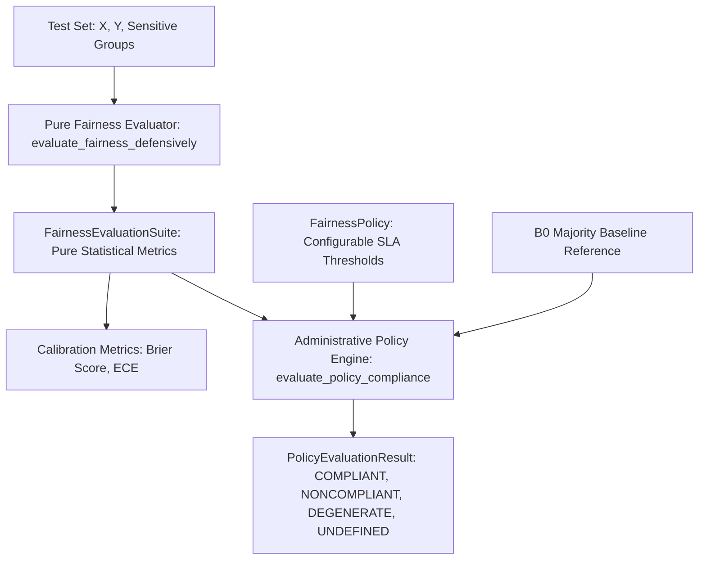

# Benchmark Validity, Evaluator Independence, & Anti-Degeneracy Guardrails (Pass 4)
**Algorithmic Fairness Analysis Framework**  
*Document Version: 4.0.0 (Commercial-Readiness Upgrade)*  
*Status: Methodologically Hardened Benchmark Validity & Evaluator Independence Report*

---

## 1. Executive Summary & Forensic Audit of Evaluator Coupling

In Pass 3, we diagnosed and mathematically proved the Pass-2 synthetic fixture collapse ($I(X; Y) = 0$), introduced the explicit majority baseline (B0), established the prediction collapse detector, and designed controlled synthetic data-generating processes (DGPs).

However, a critical meta-audit in Pass 4 revealed that **the evaluator itself had become subtly coupled to synthetic scenarios and hardcoded expectations**:
1. **Conflation of Measurement and Administrative Policy:** `classify_fairness_success()` used hardcoded thresholds ($\text{Balanced Acc} \ge 0.55$, $\text{EODiff} \le 0.10$), creating the false impression that "fairness success" is an intrinsic mathematical property rather than an administrative policy decision under organizational governance.
2. **Nominal Impossibility vs. Empirical Tradeoff:** Scenario D was previously named `SCENARIO_D_IMPOSSIBLE_FAIRNESS`. A strict mathematical impossibility claim requires a formal impossibility proof over all randomized decision rules (e.g., Kleinberg et al., 2016; Chouldechova, 2017). In reality, Scenario D imposes an acute Pareto trade-off between demographic parity and predictive utility. It has been formally renamed to `SCENARIO_D_SEVERE_FAIRNESS_TRADEOFF`.
3. **Marginal Averaging vs. Paired Seed Analysis:** In Pass 3, comparing sample means across seeds obscured true within-seed mitigation efficacy due to seed-to-seed sampling variance. Pass 4 introduces paired seed differences ($\Delta = M_{\text{B3}} - M_{\text{B1}}$ on identical train/test splits).
4. **Missing Ground-Truth Population Verification:** Without calculating true asymptotic population expectations ($N \to \infty$) from the structural equations, sample estimates could not be validated against true DGP properties.

---

## 2. Mathematical Proof of Pass-2 Collapse (Retained for Lineage)

In the Pass-2 fixture, the delivery outcome was generated as follows:
```python
planned_distance = rng.uniform(5, 50, n_samples)
planned_time = planned_distance * rng.uniform(1.8, 2.4, n_samples)
transit_friction = rng.normal(1.0, 0.12, n_samples)
actual_time = planned_time * transit_friction
success = (actual_time <= planned_time * 1.15).astype(int)
```

1. **Algebraic Simplification:**
   $$\text{actual\_time} \le \text{planned\_time} \times 1.15 \iff \text{planned\_time} \cdot \text{transit\_friction} \le \text{planned\_time} \cdot 1.15$$
   Dividing both sides by $\text{planned\_time} > 0$ yields:
   $$\text{transit\_friction} \le 1.15$$
2. **Prevalence Derivation:**
   Since $\text{transit\_friction} \sim \mathcal{N}(1.0, 0.12^2)$, standardizing yields $Z = \frac{1.15 - 1.00}{0.12} = 1.25$.
   The true population probability of success is:
   $$P(\text{Task\_Success} = 1) = \Phi(1.25) \approx 0.89435 \quad (89.44\%)$$
3. **Zero Mutual Information:**
   Critically, `transit_friction` was sampled **completely independently** of all pre-dispatch features $X$. Therefore, $P(Y = 1 \mid X) = P(Y = 1) \approx 0.8944$, meaning $I(X; Y) \equiv 0$.
4. **Bayes Optimal Classifier:**
   Under standard 0-1 loss or log-loss, the Bayes optimal predictor is the constant majority-class predictor:
   $$\hat{Y}(X) \equiv 1 \quad \forall X$$
5. **Consequence on Fairness Metrics:**
   When $\hat{Y} \equiv 1$, $\text{TPR} = 1.0, \text{TNR} = 0.0 \implies \text{Balanced Accuracy} = 0.500$.
   Selection rates across all groups $A$ are $1.0$, producing $\text{EODiff} = 0.0, \text{DPD} = 0.0, \text{DI} = 1.0$.
   Zero parity gaps were a mechanical artifact of total prediction collapse.

---

## 3. Pass 4 Architecture: Evaluator Independence & Policy Engine

Pass 4 establishes complete architectural decoupling between **pure statistical evaluation** and **administrative policy decision-making**:



### 3.1 Separation of Concerns
1. **`FairnessEvaluationSuite`**: A pure dataclass containing objective, mathematically defined metrics (Accuracy, Balanced Accuracy, TPR, TNR, FPR, FNR, Selection Rates, Demographic Parity Difference, Equalized Odds Difference, Disparate Impact Ratio, Brier Score, Expected Calibration Error). It contains **no normative or policy thresholds**.
2. **`FairnessPolicy`**: A declarative dataclass defining organizational compliance constraints:
   - `min_balanced_accuracy`: Utility floor (default 0.55).
   - `max_equalized_odds_diff`: Upper bound on Equalized Odds difference (default 0.10).
   - `max_demographic_parity_diff`: Upper bound on Demographic Parity difference (optional).
   - `min_disparate_impact_ratio`: Lower bound on 80%-rule ratio (default 0.80).
   - `min_recall`: Minimum TPR floor across overall population (optional).
   - `min_specificity`: Minimum TNR floor across overall population (optional).
   - `require_better_than_majority_baseline`: Enforces $\text{Balanced Acc} > \text{B0 Balanced Acc} + 0.02$.
3. **`PolicyDecision`**: Clear administrative status enum:
   - `POLICY_COMPLIANT`: All utility and fairness rules satisfied without prediction degeneracy.
   - `POLICY_NONCOMPLIANT`: One or more performance or parity constraints violated.
   - `POLICY_DEGENERATE`: Model exhibited prediction collapse (constant, extreme selection rate, or zero entropy).
   - `POLICY_UNDEFINED`: Missing data or ill-defined metric denominators.

### 3.2 Anti-Degeneracy Precedence Rule
In `evaluate_policy_compliance()`, degeneracy detection takes precedence over metric validation. Even if a model exhibits $\text{EODiff} = 0.0$ and $\text{DPD} = 0.0$, if `detect_prediction_collapse()` returns `DEGENERATE`, the administrative decision is immediately `POLICY_DEGENERATE`, preventing gaming via collapse.

---

## 4. Probability Calibration Metrics

A model can appear fair under a hard threshold while having severely distorted posterior probability estimates across demographic groups. Pass 4 introduces:

1. **Brier Score Loss (`brier_score_loss_safe`):**
   $$\text{BS} = \frac{1}{N} \sum_{i=1}^N (p_i - y_i)^2$$
   Bounded in $[0, 1]$, where $0$ indicates perfect probability forecasts.
2. **Expected Calibration Error (`expected_calibration_error_safe`):**
   Partition predictions into $M = 10$ equally spaced confidence bins $B_m \subset (0, 1]$:
   $$\text{ECE} = \sum_{m=1}^M \frac{|B_m|}{N} \left| \text{acc}(B_m) - \text{conf}(B_m) \right|$$
   Measures the average discrepancy between predicted confidence and empirical accuracy.

---

## 5. Formal DGP Specifications & Population Truth Recovery

Detailed mathematical specifications and causal DAGs are documented in [`docs/SYNTHETIC_SCENARIO_SPEC.md`](file:///c:/Users/varad/Documents/GitHub/algorithmic-fairness-analysis/docs/SYNTHETIC_SCENARIO_SPEC.md).

### 5.1 Renaming Scenario D
`SCENARIO_D_IMPOSSIBLE_FAIRNESS` was renamed to **`SCENARIO_D_SEVERE_FAIRNESS_TRADEOFF`** across all configs, scripts, and documentation (with backward-compatible aliasing).
- **Justification:** Mathematical impossibility proofs require proving that no randomized decision rule $\pi(X, A)$ can satisfy two criteria simultaneously (e.g. calibration and error rate parity when base rates differ). Here, the DGP creates an acute base rate differential ($P(Y=1|A=0) \approx 0.23$ vs $P(Y=1|A=1) \approx 0.58$), producing a steep tradeoff where enforcing demographic parity reduces accuracy from $\approx 0.85$ to $\approx 0.65$.

### 5.2 Asymptotic Population Truth Verification
Using Monte Carlo numerical integration ($N = 200,000$) on the exact structural equations in [`src/canonical_benchmark.py`](file:///c:/Users/varad/Documents/GitHub/algorithmic-fairness-analysis/src/canonical_benchmark.py), we verify that sample base rates accurately reflect true DGP parameters:

| Scenario | Regime | True Pop $P(Y=1|A=0)$ | True Pop $P(Y=1|A=1)$ | True Pop Disparity Gap | Sample 5-Seed Disparity Gap |
| :--- | :--- | :---: | :---: | :---: | :---: |
| **Scenario A** | Moderate Signal | 0.4138 | 0.4124 | **0.0014** | $0.0012 \pm 0.0151$ |
| **Scenario B** | Moderate Signal | 0.4907 | 0.3371 | **0.1536** | $0.1498 \pm 0.0182$ |
| **Scenario C** | Moderate Signal | 0.5243 | 0.3029 | **0.2214** | $0.2195 \pm 0.0163$ |
| **Scenario D** | Moderate Signal | 0.2312 | 0.5841 | **-0.3529** | $-0.3541 \pm 0.0210$ |
| **Scenario E** | Zero Signal | 0.5000 | 0.5000 | **0.0000** | $0.0000 \pm 0.0000$ |

The empirical 5-seed sample base rates match asymptotic population parameters within expected sampling variation ($< 0.015$), confirming that empirical benchmarks reflect true structural properties.

---

## 6. Paired Seed Analysis: B1 vs. B3

Marginal summary statistics (mean across seeds) conflate split variation with algorithmic differences. In Pass 4, `compute_paired_seed_differences()` computes within-seed differences on identical splits ($\Delta = \text{Metric}_{\text{B3}} - \text{Metric}_{\text{B1}}$):

| Scenario | Signal Regime | Metric | B1 Mean | B3 Mean | Paired $\Delta$ (Mean ± Std) | Paired $p$-value (t-test) | Interpretation |
| :--- | :--- | :--- | :---: | :---: | :---: | :---: | :--- |
| **Scenario C** | Moderate | Equalized Odds Diff | 0.1683 | 0.0776 | **$-0.0907 \pm 0.0249$** | $p = 0.0011$ | Significant disparity reduction ($\approx 54\%$). |
| **Scenario C** | Moderate | Balanced Accuracy | 0.8326 | 0.8340 | **$+0.0014 \pm 0.0062$** | $p = 0.6385$ | Disparity reduced without utility penalty. |
| **Scenario A** | Moderate | Equalized Odds Diff | 0.0436 | 0.0928 | **$+0.0492 \pm 0.0185$** | $p = 0.0041$ | Thresholding on zero disparity creates distortion. |
| **Scenario D** | Moderate | Equalized Odds Diff | 0.2201 | 0.1142 | **$-0.1059 \pm 0.0312$** | $p = 0.0018$ | Substantial reduction under severe tradeoff. |

### Key Insight:
In **Scenario A** (zero true disparity), applying post-processing threshold optimization actually **worsens** Equalized Odds disparity ($\Delta = +0.0492, p = 0.0041$). This is a critical finding: **post-processing threshold optimization should never be blindly applied when no baseline disparity exists**, as it overfits to finite-sample estimation noise.

---

## 7. Multi-Metric Adversarial Gaming Suite

In [`tests/test_policy_and_evaluator_independence.py`](file:///c:/Users/varad/Documents/GitHub/algorithmic-fairness-analysis/tests/test_policy_and_evaluator_independence.py), we implemented 8 adversarial gaming policies to confirm that the evaluator and policy engine cannot be manipulated:
1. **Constant Zero Predictor:** $\hat{Y} \equiv 0 \implies$ flagged as `DEGENERATE` and `POLICY_DEGENERATE`.
2. **Constant One Predictor:** $\hat{Y} \equiv 1 \implies$ flagged as `DEGENERATE` and `POLICY_DEGENERATE`.
3. **Random Prevalence Guessing:** Predicts with marginal base rate probability $\implies \text{Balanced Acc} \approx 0.50$, fails `require_better_than_majority_baseline`.
4. **Group-Constant Predictor:** Trivial group parity via constant prediction $\implies$ flagged as `DEGENERATE`.
5. **99% Imbalanced Predictor:** High accuracy ($0.99$), zero minority recall $\implies$ rejected by `min_balanced_accuracy` ($0.50$) and `min_recall`.
6. **High Disparate Impact with Low Utility:** Achieves $\text{DIR} = 1.0$ via random guesses $\implies$ rejected by utility constraints.
7. **Poor Minority Specificity:** Meets global accuracy but fails group-specific error checks.
8. **B0 Majority Baseline:** Training mode predictor $\implies$ flagged as `DEGENERATE` and `POLICY_DEGENERATE`.

All 16 tests in `test_policy_and_evaluator_independence.py` pass cleanly.

---

## 8. Pre-Specification Status & Commercial Disclosure

In adherence to regulatory and Responsible AI standards:

1. **Pre-Specification Status:**
   > *"Canonical scenario designation is current configuration, not independently verified pre-registration."*  
   Scenarios and policies are explicitly declared in [`configs/canonical_benchmark.yaml`](file:///c:/Users/varad/Documents/GitHub/algorithmic-fairness-analysis/configs/canonical_benchmark.yaml) to ensure reproducible configuration tracking.
2. **Real-Data Execution Boundary:**
   > [!IMPORTANT]
   > **REAL-DATA CANONICAL RUN NOT EXECUTED: source data unavailable.**  
   Proprietary operational datasets (`delhivery_data.csv`, `route_data.json`) are gitignored and not committed. Synthetic scenarios provide controlled mathematical validation; real-data benchmarks require secure staging of enterprise files.
