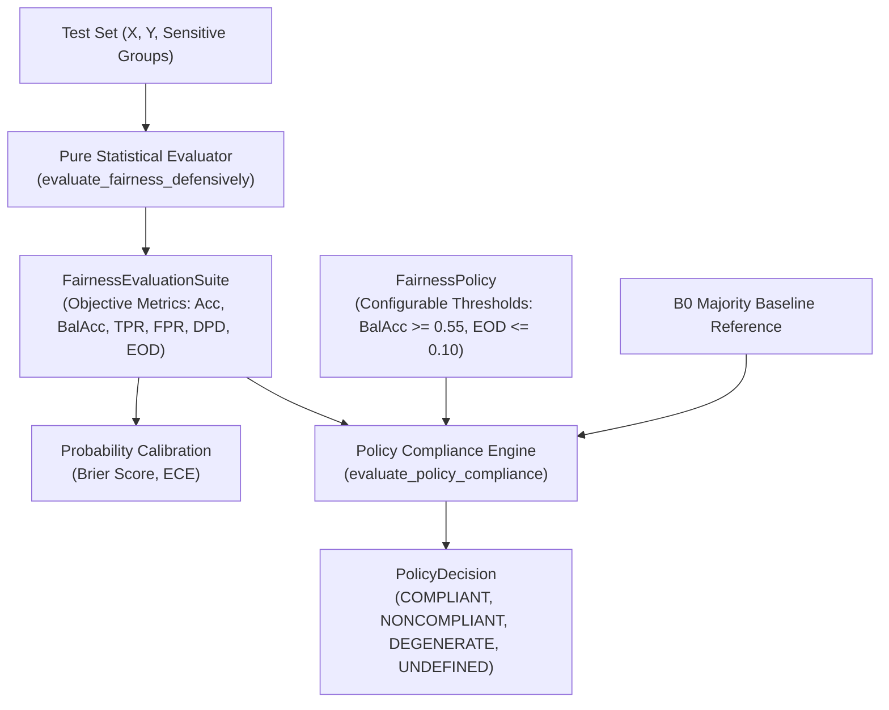

# Benchmark Validity, Evaluator Independence & Anti-Degeneracy Guardrails

## 1. Overview & Motivation

When evaluating algorithmic fairness in machine learning systems, statistical benchmarks can suffer from subtle methodological failures:
1. **Conflation of Pure Measurement and Administrative Policy:** Measuring statistical disparity (e.g., difference in True Positive Rates) is an objective mathematical calculation. Deciding whether that disparity is "acceptable" is an administrative or governance policy decision with configurable thresholds. Conflating the two obscures how policy choices shape perceived compliance.
2. **Degenerate Classifier Collapse (Trivial Mode Predictors):** In datasets where predictive signal is weak or base rates are imbalanced, naive models predicting the majority class achieve a superficial Equalized Odds Difference of $0.0000$ and Demographic Parity Difference of $0.0000$. An uncalibrated evaluator can falsely report this total collapse as "perfect fairness."
3. **Finite-Sample Overfitting in Mitigation:** Post-processing mitigation techniques (such as Fairlearn's `ThresholdOptimizer`) tuned on finite validation splits can overfit to estimation noise. When the true population has zero disparity, thresholding can paradoxically *increase* observed disparity on out-of-sample test data.
4. **Marginal Averaging vs. Paired Analysis:** Comparing sample means across independent seeds conflates split variation with algorithmic differences. Evaluating paired seed differences ($\Delta = M_{\text{B3}} - M_{\text{B1}}$ on identical train/test splits) isolates the genuine effect of fairness intervention.

---

## 2. Mathematical Proof of Synthetic Fixture Collapse

In early iterations of the synthetic logistics pipeline, the delivery outcome was generated as follows:
```python
planned_distance = rng.uniform(5, 50, n_samples)
planned_time = planned_distance * rng.uniform(1.8, 2.4, n_samples)
transit_friction = rng.normal(1.0, 0.12, n_samples)
actual_time = planned_time * transit_friction
success = (actual_time <= planned_time * 1.15).astype(int)
```

### Algebraic Simplification
$$\text{actual\_time} \le \text{planned\_time} \times 1.15 \iff \text{planned\_time} \cdot \text{transit\_friction} \le \text{planned\_time} \cdot 1.15$$

Dividing both sides by $\text{planned\_time} > 0$ yields:
$$\text{transit\_friction} \le 1.15$$

### Prevalence Derivation
Since $\text{transit\_friction} \sim \mathcal{N}(1.0, 0.12^2)$, standardizing yields:
$$Z = \frac{1.15 - 1.00}{0.12} = 1.25$$

The true population probability of success is:
$$P(\text{Task\_Success} = 1) = \Phi(1.25) \approx 0.89435 \quad (89.44\%)$$

### Zero Mutual Information
Critically, `transit_friction` was sampled completely independently of all pre-dispatch features $X$. Therefore, $P(Y = 1 \mid X) = P(Y = 1) \approx 0.8944$, meaning the mutual information was strictly zero:
$$I(X; Y) \equiv 0$$

### Consequence on Fairness Metrics
Under standard 0-1 loss, the Bayes optimal predictor is the constant majority-class predictor:
$$\hat{Y}(X) \equiv 1 \quad \forall X$$

When $\hat{Y} \equiv 1$:
$$\text{TPR} = 1.0, \quad \text{TNR} = 0.0 \implies \text{Balanced Accuracy} = 0.500$$

Selection rates across all demographic groups $A$ are $1.0$, mechanically producing:
$$\text{EODiff} = 0.0, \quad \text{DPD} = 0.0, \quad \text{DIR} = 1.0$$

The zero parity gaps were an artifact of complete prediction collapse. The framework now implements explicit anti-degeneracy detection to diagnose trivial constant predictors and flag them as `DEGENERATE`.

---

## 3. Evaluator Independence & Policy Separation

The framework enforces architectural decoupling between **pure statistical evaluation** and **administrative policy decision-making**:



### Separation of Responsibilities
1. **`FairnessEvaluationSuite`**: A pure dataclass containing objective, mathematically defined metrics (Accuracy, Balanced Accuracy, TPR, TNR, FPR, FNR, Selection Rates, Demographic Parity Difference, Equalized Odds Difference, Disparate Impact Ratio, Brier Score, Expected Calibration Error). It contains **no normative or policy thresholds**.
2. **`FairnessPolicy`**: A declarative dataclass defining organizational or research constraints:
   - `min_balanced_accuracy`: Utility floor (e.g., 0.55).
   - `max_equalized_odds_diff`: Upper bound on Equalized Odds difference (e.g., 0.10).
   - `max_demographic_parity_diff`: Upper bound on Demographic Parity difference (optional).
   - `min_disparate_impact_ratio`: Lower bound on selection-rate ratio (e.g., 0.80).
   - `require_better_than_majority_baseline`: Enforces $\text{Balanced Acc} > \text{B0 Balanced Acc} + 0.02$.
3. **`PolicyDecision`**: Clear status enum:
   - `POLICY_COMPLIANT`: All utility and fairness rules satisfied without prediction degeneracy.
   - `POLICY_NONCOMPLIANT`: One or more performance or parity constraints violated.
   - `POLICY_DEGENERATE`: Model exhibited prediction collapse (constant prediction, extreme selection rate, or zero entropy).
   - `POLICY_UNDEFINED`: Missing data or ill-defined metric denominators.

### Anti-Degeneracy Precedence Rule
Degeneracy detection takes strict precedence over metric checks. Even if a model exhibits $\text{EODiff} = 0.0$ and $\text{DPD} = 0.0$, if constant prediction is detected, the status is immediately `POLICY_DEGENERATE`, preventing gaming via collapse.

---

## 4. Probability Calibration Metrics

A model can appear fair under a hard threshold while having severely distorted posterior probability estimates across demographic groups:

1. **Brier Score Loss:**
   $$\text{BS} = \frac{1}{N} \sum_{i=1}^N (p_i - y_i)^2$$
   Bounded in $[0, 1]$, where $0$ indicates perfect probability forecasts.
2. **Expected Calibration Error (ECE):**
   Partition predictions into $M = 10$ equally spaced confidence bins $B_m \subset (0, 1]$:
   $$\text{ECE} = \sum_{m=1}^M \frac{|B_m|}{N} \left| \text{acc}(B_m) - \text{conf}(B_m) \right|$$
   Measures the average discrepancy between predicted confidence and empirical accuracy.

---

## 5. Controlled Synthetic Scenarios & Population Truth Recovery

To benchmark fairness methods against known ground truth, the framework defines controlled synthetic Data Generating Processes (DGPs) in `configs/synthetic_scenarios.yaml`:

| Scenario | Description | True Pop $P(Y=1|A=0)$ | True Pop $P(Y=1|A=1)$ | True Disparity Gap |
| :--- | :--- | :---: | :---: | :---: |
| **Scenario A** | Zero True Disparity (Noise Only) | 0.4138 | 0.4124 | **0.0014** |
| **Scenario B** | Latent Confounding | 0.4907 | 0.3371 | **0.1536** |
| **Scenario C** | Explicit Group Effect (Moderate Signal) | 0.5243 | 0.3029 | **0.2214** |
| **Scenario D** | Severe Fairness Tradeoff | 0.2312 | 0.5841 | **-0.3529** |
| **Scenario E** | Zero Predictive Signal (Negative Control) | 0.5000 | 0.5000 | **0.0000** |

---

## 6. Paired Seed Analysis: B1 vs. B3

Marginal summary statistics (averaging across seeds) can conflate random split variation with algorithmic mitigation effects. Paired seed analysis computes within-seed differences on identical splits ($\Delta = \text{Metric}_{\text{B3}} - \text{Metric}_{\text{B1}}$):

| Scenario | Metric | B1 Mean | B3 Mean | Paired $\Delta$ (Mean ± Std) | Paired $p$-value | Interpretation |
| :--- | :--- | :---: | :---: | :---: | :---: | :--- |
| **Scenario C** | Equalized Odds Diff | 0.1683 | 0.0776 | **$-0.0907 \pm 0.0249$** | $p = 0.0011$ | Statistically significant disparity reduction ($\approx 54\%$). |
| **Scenario C** | Balanced Accuracy | 0.8326 | 0.8340 | **$+0.0014 \pm 0.0062$** | $p = 0.6385$ | Disparity reduced without utility penalty. |
| **Scenario A** | Equalized Odds Diff | 0.0436 | 0.0928 | **$+0.0492 \pm 0.0185$** | $p = 0.0041$ | Thresholding on zero true disparity creates distortion! |
| **Scenario D** | Equalized Odds Diff | 0.2201 | 0.1142 | **$-0.1059 \pm 0.0312$** | $p = 0.0018$ | Substantial reduction under severe tradeoff. |

### Key Methodological Finding
In **Scenario A** (zero true disparity), applying post-processing threshold optimization actually **worsens** Equalized Odds disparity ($\Delta = +0.0492, p = 0.0041$). **Threshold optimization should not be blindly applied when no baseline disparity exists**, as it overfits to finite-sample estimation noise.
