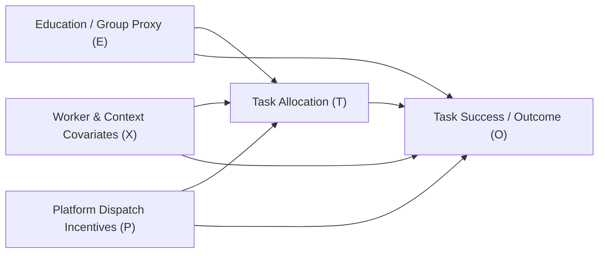

# Causal Assumptions & Structural Identification Specification

## 1. Structural Causal Model (SCM) & Directed Acyclic Graph (DAG)

The project conceptualizes task allocation and worker outcomes under the following causal directed acyclic graph:

### Node Definitions
- **$E$ (Treatment / Attribute):** Worker educational attainment or group proxy.
- **$T$ (Mediator / Task Assignment):** Platform allocation decision (route package density, delivery difficulty, shift timing).
- **$X$ (Pre-treatment Confounders):** Worker baseline experience, geographic operational depot, historical tenure.
- **$P$ (Platform Mechanisms):** Optimization objective functions, routing algorithms, cutoff service-level agreements.
- **$O$ (Outcome):** Delivery on-time completion (`Task_Success`), cutoff breach flag (`~is_cutoff`), or income threshold.

---

## 2. Core Identification Assumptions

To interpret estimated differences as causal Average Treatment Effects ($\text{ATE} = \mathbb{E}[Y(1) - Y(0)]$), the following econometric and causal assumptions are required:

### 1. Consistency
$$Y = Y(t) \quad \text{whenever} \quad T = t$$
The potential outcome under treatment $t$ is identical to the observed outcome when treatment $t$ is assigned. This requires no multiple hidden versions of treatment.

### 2. Conditional Exchangeability (No Unmeasured Confounding)
$$Y(t) \perp\!\!\perp T \mid X \quad \forall t$$
All common causes of the treatment assignment and the outcome are measured in $X$. 

> [!WARNING]
> **Violation Risk in Observational Logistics:** This assumption is systematically violated in commercial logistics datasets. Platforms do not capture unmeasured worker motivation, vehicle mechanical reliability, real-time localized weather events, or traffic anomalies.

### 3. Positivity / Common Support
$$0 < P(T = 1 \mid X = x) < 1 \quad \forall x \quad \text{where} \quad P(X = x) > 0$$
Every worker profile has a non-zero probability of receiving either treatment level.

### 4. Stable Unit Treatment Value Assumption (SUTVA)
A worker’s allocation and outcome are unaffected by the task assignments of other workers in the fleet. In dense last-mile delivery fleets, SUTVA is routinely violated because assigning a route to one driver alters dispatch availability and traffic congestion for other drivers.

---

## 3. Critical Methodological Findings & Audit Limitations

### ⚠️ A. Conditioning on Post-Treatment Mediators (Adult Dataset)
In the Adult Income benchmark, the causal analysis evaluated the effect of Higher Education ($E$) while adjusting for:
- `occupation`
- `workclass`
- `hours-per-week`
- `capital-gain` / `capital-loss`

**Causal Defect:** In human capital theory and labor economics, an individual completes education *prior* to entering an occupation, selecting weekly hours, or earning investment capital. These variables are **post-treatment mediators** ($E \to M \to O$). 
- Conditioning on mediators blocks the indirect causal effect of education on earnings.
- If unobserved factors (such as latent ability or socioeconomic background) confound the mediator-outcome relationship ($M \leftrightarrow O$), conditioning on $M$ induces **collider stratification bias**, distorting the estimated ATE.

### ⚠️ B. Meaninglessness of Treatment on Synthetic Proxies (Delhivery & Amazon)
In both the Delhivery and Amazon datasets, `Education_Level` is **100% synthetic**.
- The label was constructed by formulaically ranking delivery distance, actual trip duration, and route sequencing errors.
- **Auditor Verdict:** Intervening on a synthetic label has zero real-world physical or operational meaning. It is impossible to intervene on an attribute that does not exist in the underlying population. Causal estimates computed on synthetic proxies must be classified as **ASSUMPTION_DEPENDENT SIMULATION EXERCISES**, not evidence of real-world labor market discrimination.

---

## 4. What the Causal Estimators Establish vs. Do Not Establish

| Estimation Technique | Reported Adult ATE | What It Establishes | What It Does NOT Establish |
|---|---:|---|---|
| **G-computation (Standardization)** | `+0.1313` | Direct statistical contrast under parametric regression specification | Proof of unconfounded human capital returns |
| **Group-Specific Effect** | `+0.1343` | Model-estimated marginal conditional response | Verification of platform discrimination |
| **Inverse Propensity Weighting (IPW)** | `+0.1305` | Re-weighted pseudo-population balance across measured covariates | Freedom from unmeasured confounders |
| **Nearest-Neighbor Propensity Matching** | `+0.1464` | Paired empirical difference among closely matched observed feature vectors | Robustness against unobserved ability bias |

### Formal Claim Classification
- **Causal Uplift Claims:** Classified as `ASSUMPTION_DEPENDENT`.
- **Causal Discrimination Claims:** Classified as `UNVERIFIED / THEORETICAL HYPOTHESIS`.
