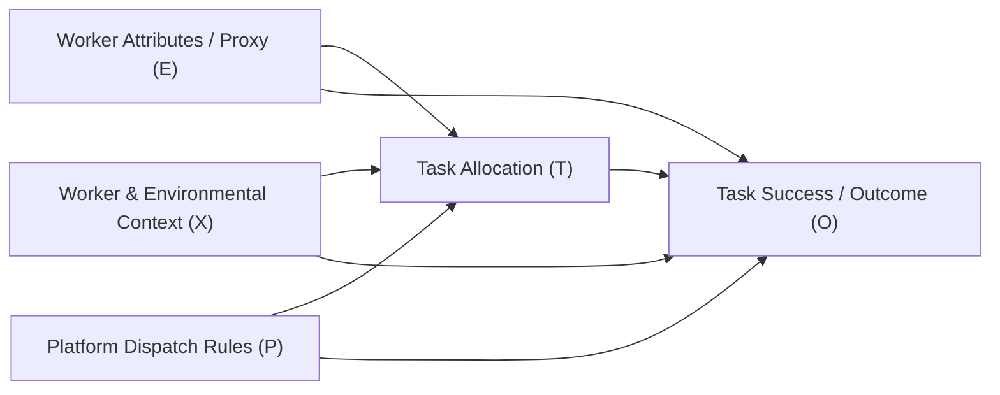

# Causal Assumptions & Structural Identification

## 1. Structural Causal Model (SCM) & Directed Acyclic Graph (DAG)

In algorithmic decision-making and gig-economy routing, task allocation decisions and worker outcomes are governed by structural relationships among worker attributes, context, platform dispatch rules, and realized outcomes.

We formalize these relationships using the following causal Directed Acyclic Graph (DAG):

### Node Definitions
- **$E$ (Treatment / Sensitive Attribute):** Worker educational attainment, demographic trait, or proxy attribute.
- **$T$ (Mediator / Task Assignment):** Platform task allocation decision (e.g., route package density, assignment difficulty, scheduled shift timing).
- **$X$ (Pre-treatment Covariates & Confounders):** Worker baseline experience, operational depot, historical tenure, vehicle type.
- **$P$ (Platform Mechanisms):** Optimization objective functions, routing heuristics, cutoff service-level agreements.
- **$O$ (Outcome):** Task on-time completion (`Task_Success`), cutoff breach flag (`~is_cutoff`), or income threshold.

---

## 2. Core Identification Assumptions

To interpret statistical disparities as causal Average Treatment Effects ($\text{ATE} = \mathbb{E}[Y(1) - Y(0)]$), the following econometric and causal identification assumptions are required:

### 1. Consistency
$$Y = Y(t) \quad \text{whenever} \quad T = t$$
The potential outcome under treatment $t$ is identical to the observed outcome when treatment $t$ is assigned. This requires no multiple unmodeled versions of treatment.

### 2. Conditional Exchangeability (No Unmeasured Confounding)
$$Y(t) \perp\!\!\perp T \mid X \quad \forall t$$
All common causes of the task assignment and the outcome must be fully captured in the conditioning set $X$.

> [!WARNING]
> **Violation Risk in Observational Logistics:** This assumption is systematically challenged in observational logistics datasets. Real-world dispatch platforms rarely record unmeasured driver motivation, localized real-time traffic anomalies, weather events, or vehicle mechanical reliability. Without these, conditional exchangeability cannot be assumed.

### 3. Positivity / Common Support
$$0 < P(T = 1 \mid X = x) < 1 \quad \forall x \quad \text{where} \quad P(X = x) > 0$$
Every worker profile has a non-zero probability of receiving either treatment level.

### 4. Stable Unit Treatment Value Assumption (SUTVA)
A worker’s allocation and outcome are unaffected by the task assignments of other workers in the fleet. In dense last-mile delivery fleets, SUTVA is routinely violated: assigning a route to one driver alters dispatch availability, route competition, and local congestion for other drivers.

---

## 3. Critical Methodological Findings & Limitations

### A. Conditioning on Post-Treatment Mediators (Adult Dataset)
In observational analysis of the Adult Income benchmark, estimating the causal return to Higher Education ($E$) while conditioning on:
- `occupation`
- `workclass`
- `hours-per-week`
- `capital-gain` / `capital-loss`

introduces a fundamental causal defect:
- In labor economics, educational attainment precedes occupational choice, weekly hours, and capital investments ($E \to M \to O$). These variables are **post-treatment mediators**.
- Conditioning on mediators blocks the indirect causal effect of education on earnings.
- Furthermore, if unobserved factors (such as latent ability or socioeconomic background) confound the mediator-outcome relationship ($M \leftrightarrow O$), conditioning on $M$ induces **collider stratification bias**, distorting the estimated ATE.

### B. Meaning of Causal Interventions on Synthetic Proxies
In observational logistics datasets lacking demographic records (e.g., Delhivery and Amazon), `Education_Level` was constructed as a synthetic proxy derived from delivery distance, trip duration, and route sequencing.
- Intervening on a synthetic label in a causal model has no physical or real-world demographic meaning.
- It is impossible to intervene on an attribute that does not exist in the underlying population.
- Causal estimates computed on synthetic proxies must be classified as **simulation exercises illustrating estimation mechanics**, not evidence of real-world labor market discrimination.

---

## 4. What the Causal Estimators Establish vs. Do Not Establish

| Estimation Technique | Reported Adult ATE | What It Establishes | What It Does NOT Establish |
|---|---:|---|---|
| **G-computation (Standardization)** | `+0.1313` | Direct statistical contrast under a parametric regression specification | Proof of unconfounded human capital returns |
| **Group-Specific Contrast** | `+0.1343` | Model-estimated marginal conditional response | Verification of platform discrimination |
| **Inverse Propensity Weighting (IPW)** | `+0.1305` | Re-weighted pseudo-population balance across measured covariates | Freedom from unmeasured confounders |
| **Nearest-Neighbor Propensity Matching** | `+0.1464` | Paired empirical difference among closely matched observed feature vectors | Robustness against unobserved ability bias |

### Key Takeaway
Causal estimation provides valuable structural vocabulary for reasoning about discrimination and task allocation, but causal claims remain **strictly conditional on unverifiable identification assumptions**.
