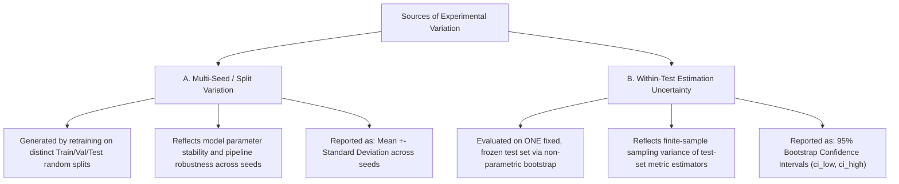

# Intersectional Fairness, Sparse Subgroups & Uncertainty Estimation

## 1. Why Marginal Fairness Fails (Fairness Gerrymandering)

Standard fairness benchmarks typically evaluate protected attributes along single marginal axes (e.g., evaluating `Region` or `Vehicle_Type` in isolation). This practice introduces a critical vulnerability known as **fairness gerrymandering** or **marginal masking**:

> **The Intersectional Blindspot:**
> A predictive model can appear completely fair when evaluated along single marginal dimensions (e.g., Equalized Odds Difference $\approx 0.0$ across `Gender` and $\approx 0.0$ across `Region`), while exhibiting severe, systematic error rate disparities against specific intersectional subgroups (e.g., `Gender=Female x Region=Rural`).

---

## 2. Multi-Attribute Intersectional Grouping

The framework supports declarative intersectional grouping via `IntersectionalGroupSpec`:

```python
from src.fairness_evaluator import IntersectionalGroupSpec, build_intersectional_groups

spec = IntersectionalGroupSpec(
    attributes=["region", "vehicle_class", "shift_tier"],
    name="Logistics_Intersectional_Cluster",
    min_group_size=20,
    min_group_positives=5,
    min_group_negatives=5,
)
composite_series, provenance_map = build_intersectional_groups(df, spec)
```

### Explicit Subgroup Provenance
Rather than generating opaque hashed group identifiers, `build_intersectional_groups()` constructs transparent composite labels (e.g., `"North x Van x Night"`) and produces a provenance map tracking the constituent feature-value pairs.

---

## 3. Sparse-Group Handling & Support Gating

Intersectional stratification exponentially fragments sample sizes. In small demographic cells ($N < 10$), standard error rates fluctuate wildly: a single prediction change can swing TPR from $0.0$ to $1.0$.

### Gating Rules & Defenses
For every subgroup, the evaluator reports:
- Sample size ($N$), positive ground-truth count ($N_{\text{pos}} = \text{TP} + \text{FN}$), negative ground-truth count ($N_{\text{neg}} = \text{TN} + \text{FP}$)
- Confusion matrix cells ($\text{TP}, \text{TN}, \text{FP}, \text{FN}$)
- Selection rate, $\text{TPR}, \text{TNR}, \text{FPR}, \text{FNR}, \text{PPV}$, Balanced Accuracy, Brier score, and ECE.

If any subgroup fails support thresholds:
1. $N_g < \text{min\_group\_size}$: Group is marked `INSUFFICIENT_GROUP_SUPPORT`.
2. $N_{\text{pos}} < \text{min\_group\_positives}$: Rate is flagged `INSUFFICIENT_GROUP_SUPPORT` (or `ZERO_POSITIVE_SUBGROUP` if zero).
3. $N_{\text{neg}} < \text{min\_group\_negatives}$: Rate is flagged `INSUFFICIENT_GROUP_SUPPORT` (or `ZERO_NEGATIVE_SUBGROUP` if zero).

> [!CAUTION]
> **No Silent Zero Fallbacks:**  
> If an intersectional cell has insufficient support, disparity metrics (Equalized Odds Diff, Disparate Impact Ratio) return `NaN` with status `INSUFFICIENT_GROUP_SUPPORT`. The framework refuses to return a zero disparity score that could be misinterpreted as evidence of fairness.

---

## 4. Two Distinct Sources of Experimental Variation

A common error in machine learning evaluation is conflating partition variance with sample estimation uncertainty:



### Separation in Reporting
- **Seed Variation:** Captured via `accuracy_std`, `balanced_accuracy_std`, `equalized_odds_diff_std` across multiple seeds.
- **Finite-Sample Estimation Uncertainty:** Captured via non-parametric bootstrap confidence intervals (e.g., 95% percentile bootstrap).
- These two distinct quantities should never be averaged or conflated into a single interval.

---

## 5. Global vs. Subgroup Utility

Relying exclusively on global Balanced Accuracy permits models that achieve overall utility by completely sacrificing minority subgroups.

`FairnessPolicy` allows enforcing explicit subgroup performance floors:
```python
policy = FairnessPolicy(
    name="Subgroup_Utility_Policy",
    min_balanced_accuracy=0.70,           # Global utility floor
    min_subgroup_balanced_accuracy=0.55,  # Subgroup utility floor
    min_subgroup_recall=0.50,             # Subgroup sensitivity floor
    max_equalized_odds_diff=0.10,
)
```
If a model achieves $0.85$ global Balanced Accuracy but drops to $0.40$ Balanced Accuracy on a protected subgroup, the policy marks it `POLICY_NONCOMPLIANT`, surfacing the subgroup utility sacrifice.
