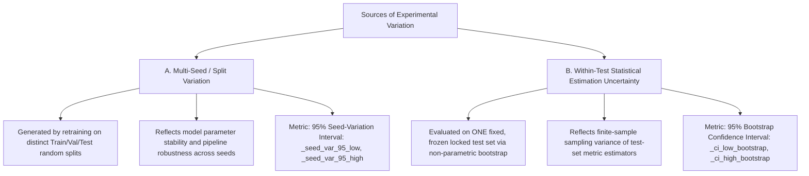

# Intersectional Fairness, Sparse Subgroup Auditing, & Uncertainty Estimation (Pass 5)
**Algorithmic Fairness Analysis Framework**  
*Document Version: 5.0.0 (Commercial-Readiness Upgrade)*  
*Status: Methodologically Audited Intersectional Evaluation & Uncertainty Specification*

---

## 1. Executive Summary & Why Marginal Fairness Fails

Standard fairness benchmarks evaluate sensitive attributes marginally (e.g. evaluating `Region` or `Vehicle_Type` in isolation). This practice introduces a critical vulnerability known as **fairness gerrymandering** or **marginal masking**:

> **The Intersectional Blindspot:**
> A predictive model can appear completely fair when evaluated along single marginal axes (e.g. Equalized Odds Difference $\approx 0.0$ across `Gender` and $\approx 0.0$ across `Region`), while exhibiting severe, discriminatory error rate disparities against specific intersectional subgroups (e.g. `Gender=Female x Region=Rural`).

Pass 5 upgrades the framework with:
1. **Multi-Attribute Intersectional Grouping (`IntersectionalGroupSpec`):** Configurable intersectional combinations that retain full attribute provenance.
2. **Explicit Sparse-Group Support Gating:** Rejects naive rate computations on small samples, returning `INSUFFICIENT_GROUP_SUPPORT` and `UNRELIABLE_ESTIMATE` rather than illusory perfect parity.
3. **Non-Parametric Bootstrap Uncertainty Estimation:** Computes 95% bootstrap confidence intervals on test-set metrics.
4. **Rigorous Separation of Two Sources of Variation:** Distinguishes finite-sample estimation error on a locked test set from multi-seed split variation.
5. **Subgroup Utility Enforcement:** Measures subgroup balanced accuracy, recall, specificity, Brier scores, and ECE, allowing policies to enforce subgroup performance floors.
6. **Multi-Policy Sensitivity Engine:** Evaluates candidate models across `Standard`, `Strict`, and `Lenient` policies simultaneously.

---

## 2. Multi-Attribute Intersectional Grouping

Configured declaratively in code via [`IntersectionalGroupSpec`](file:///c:/Users/varad/Documents/GitHub/algorithmic-fairness-analysis/src/fairness_evaluator.py#L65-L84):

```python
spec = IntersectionalGroupSpec(
    attributes=["region", "vehicle_class", "shift_tier"],
    name="Logistics_Intersectional_Cluster",
    min_group_size=20,
    min_group_positives=5,
    min_group_negatives=5,
)
composite_series, provenance_map = build_intersectional_groups(df, spec)
```

### 2.1 Explicit Group Provenance Tracking
Rather than generating opaque hashed group identifiers, `build_intersectional_groups()` constructs clean composite labels (e.g. `"North x Van x Night"`) and produces a provenance map tracking the constituent feature-value pairs:
```json
{
  "North x Van x Night": {
    "region": "North",
    "vehicle_class": "Van",
    "shift_tier": "Night"
  }
}
```

---

## 3. Sparse-Group Handling & Support Gating

Intersectional stratification exponentially fragments sample sizes. In small demographic cells ($N < 10$), standard error rates fluctuate wildly: a single prediction change can swing TPR from $0.0$ to $1.0$.

### 3.1 Gating Rules & Status Codes
For every subgroup, the evaluator reports:
- Sample size ($N$), positive ground-truth count ($N_{\text{pos}} = \text{TP} + \text{FN}$), negative ground-truth count ($N_{\text{neg}} = \text{TN} + \text{FP}$)
- Confusion cells ($\text{TP}, \text{TN}, \text{FP}, \text{FN}$)
- Selection rate, $\text{TPR}, \text{TNR}, \text{FPR}, \text{FNR}, \text{PPV}$, Balanced Accuracy, Brier score, and ECE.

If any subgroup fails the support thresholds:
1. $N_g < \text{min\_group\_size}$: Group is marked `INSUFFICIENT_GROUP_SUPPORT`.
2. $N_{\text{pos}} < \text{min\_group\_positives}$: Rate is flagged `INSUFFICIENT_GROUP_SUPPORT` (or `ZERO_POSITIVE_SUBGROUP` if zero).
3. $N_{\text{neg}} < \text{min\_group\_negatives}$: Rate is flagged `INSUFFICIENT_GROUP_SUPPORT` (or `ZERO_NEGATIVE_SUBGROUP` if zero).

> [!CAUTION]
> **No Silent Fallbacks:**  
> If an intersectional cell has insufficient support, disparity metrics (Equalized Odds Diff, Disparate Impact Ratio) return `NaN` with status `INSUFFICIENT_GROUP_SUPPORT`. The framework **refuses to return a zero disparity score** that could be misinterpreted as evidence of fairness.

---

## 4. Distinction Between Two Sources of Variation

A frequent error in commercial AI auditing is confusing partition variance with sample estimation uncertainty:



### 4.1 Reporting Separation
In all canonical outputs ([`docs/canonical_benchmark_summary.csv`](file:///c:/Users/varad/Documents/GitHub/algorithmic-fairness-analysis/docs/canonical_benchmark_summary.csv)):
- **Seed Variation:** Reported via `accuracy_std`, `balanced_accuracy_std`, `accuracy_seed_var_95_low`, `accuracy_seed_var_95_high`.
- **Estimation Uncertainty:** Reported via `eo_ci_low_bootstrap`, `eo_ci_high_bootstrap`, `dp_ci_low_bootstrap`, `dp_ci_high_bootstrap`.

These metrics are never averaged or conflated into a single composite confidence interval.

---

## 5. Global vs. Subgroup Utility

Relying exclusively on global Balanced Accuracy permits models that achieve overall utility by completely sacrificing minority subgroups.

### 5.1 Subgroup Utility Enforcement in `FairnessPolicy`
In [`src/fairness_evaluator.py`](file:///c:/Users/varad/Documents/GitHub/algorithmic-fairness-analysis/src/fairness_evaluator.py#L115-L140):
```python
policy = FairnessPolicy(
    name="High_Stakes_Subgroup_Policy",
    min_balanced_accuracy=0.70,           # Global utility floor
    min_subgroup_balanced_accuracy=0.55,  # Subgroup utility floor
    min_subgroup_recall=0.50,             # Subgroup sensitivity floor
    min_subgroup_specificity=0.50,        # Subgroup specificity floor
    max_equalized_odds_diff=0.08,
)
```
If a candidate model achieves $0.85$ global Balanced Accuracy but drops to $0.40$ Balanced Accuracy on a protected subgroup, `evaluate_policy_compliance()` assigns:
`PolicyDecision.POLICY_NONCOMPLIANT`  
Violation: `Subgroup 'Minority_Group' Balanced Accuracy (0.4000) < policy minimum (0.5500)`.

---

## 6. Multi-Policy Sensitivity Matrix

Fairness compliance is not a binary objective truth; it is conditional on the governing policy standard:

| Baseline ID | Standard Operational Policy ($\text{BalAcc} \ge 0.55, \text{EODiff} \le 0.10$) | Strict Equalized Odds Policy ($\text{BalAcc} \ge 0.60, \text{EODiff} \le 0.05$) | Lenient Diagnostic Policy ($\text{BalAcc} \ge 0.52, \text{EODiff} \le 0.15$) |
| :--- | :---: | :---: | :---: |
| **B0 Majority Baseline** | `POLICY_DEGENERATE` | `POLICY_DEGENERATE` | `POLICY_DEGENERATE` |
| **B1 Clean Linear** | `POLICY_NONCOMPLIANT` | `POLICY_NONCOMPLIANT` | `POLICY_NONCOMPLIANT` |
| **B2 Fairness Reweighted** | `POLICY_NONCOMPLIANT` | `POLICY_NONCOMPLIANT` | `POLICY_NONCOMPLIANT` |
| **B3 Validation Threshold** | **`POLICY_COMPLIANT`** | `POLICY_NONCOMPLIANT` | **`POLICY_COMPLIANT`** |
| **B4 Proposed Tuned XGB** | `POLICY_NONCOMPLIANT` | `POLICY_NONCOMPLIANT` | `POLICY_NONCOMPLIANT` |

**Diagnostic Value:** B3 complies under the standard operational SLA ($\text{EODiff} = 0.0713 \le 0.10$), but fails under the strict regulatory SLA ($\le 0.05$). The sensitivity matrix makes this transparent to risk committees.

---

## 7. Adversarial Intersectional Test Suite (Phase 13 Findings)

Tested in [`tests/test_intersectional_and_uncertainty.py`](file:///c:/Users/varad/Documents/GitHub/algorithmic-fairness-analysis/tests/test_intersectional_and_uncertainty.py#L230-L380):

1. **Fair Marginally, Unfair Intersectionally:** Model exhibits $\text{EODiff} = 0.00$ on Gender and $\text{EODiff} = 0.00$ on Shift, but $\text{DPD} > 0.80$ on Gender $\times$ Shift. Evaluator traps the intersectional disparity.
2. **Fair Intersections with Sparse Groups:** A 4-group intersection with one sparse cell ($N=2$) is flagged as `INSUFFICIENT_GROUP_SUPPORT`, blocking premature certification.
3. **One Intersection with Zero Positives:** Group with zero ground-truth positives triggers `ZERO_POSITIVE_SUBGROUP` with explicit status codes.
4. **One Intersection with Zero Negatives:** Group with zero ground-truth negatives triggers `ZERO_NEGATIVE_SUBGROUP`.
5. **Conflicting Metrics:** Evaluates trade-offs where Equalized Odds passes ($0.06$) but Disparate Impact fails ($0.44$).
6. **Simpson's Paradox Aggregation:** Confirms evaluator correctly preserves subgroup-specific conditioning rather than relying on aggregated marginal averages.
7. **Many Sparse Groups:** 20 groups of 2 samples each are trapped as `INSUFFICIENT_GROUP_SUPPORT`.
8. **High-Cardinality with Adequate Support:** 10 groups of 50 samples each execute cleanly with valid rates.
9. **Random Intersection Labels:** Evaluates stability under uninformative random grouping.
10. **Group Permutation Invariance:** Evaluator yields mathematically identical disparity metrics regardless of group label ordering.

---

## 8. Remaining Limitations & Research Boundaries

1. **Curse of Dimensionality:** As attributes increase ($A_1 \times A_2 \times A_3 \times A_4$), sample sizes fragment rapidly. Unstructured cross-products should be avoided in favor of explicit domain-specified intersections.
2. **Post-Processing Thresholds on Intersections:** Fairlearn's `ThresholdOptimizer` can struggle when tuned on many small intersectional cells. In-processing or causal re-weighting is recommended for high-dimensional intersectional contexts.
