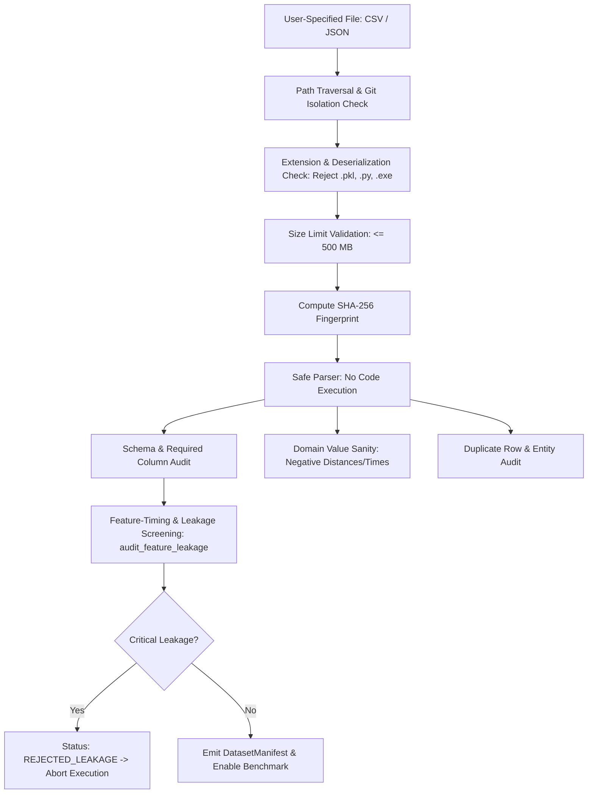

# Real-Data Ingestion, Provenance, & Locked Evaluation Protocol (Pass 7)
**Algorithmic Fairness Analysis Framework**  
*Document Version: 7.0.0 (Evidence-Qualified Engineering Verification)*  
*Status: Methodologically Audited Ingestion & Real-Data Validation Specification*

---

## 1. Executive Summary & The Real-Data Boundary

A common vulnerability in algorithmic fairness toolkits is the blurring of boundaries between synthetic fixtures and genuine empirical findings, or the unverified ingestion of customer data into version-controlled repositories.

**Pass 7 establishes an uncompromising architecture for real-data handling:**
1. **Zero Data Fabrication Policy:** External proprietary datasets (`delhivery_data.csv`, `route_data.json`) are gitignored and not stored in the repository. If local data is unstaged, the framework explicitly outputs:
   `[NOTICE] REAL-DATA CANONICAL RUN NOT EXECUTED: source data unavailable or demo mode requested.`
   Formal customer staging protocols and non-fabrication principles are documented in [`docs/EXTERNAL_VALIDATION_PENDING.md`](EXTERNAL_VALIDATION_PENDING.md).
2. **Clear Claim Distinction (Standard Taxonomy):**
   - **`INTERNAL_ENGINEERING_VERIFICATION`**: Internal framework integrity, security gating, and unit assertions pass regression testing (140 passing tests).
   - **`SYNTHETIC_DGP_VALIDATION`**: Controlled synthetic Data Generating Process verification with mathematically known ground-truth mechanisms.
   - **`INDEPENDENT_ORACLE_VALIDATION`**: Direct verification against pure Python hand-derived arithmetic oracles and reference libraries (`fairlearn`, `scikit-learn`).
   - **`EXTERNAL_REAL_DATA_VALIDATION`**: An enterprise execution performed on staged, licensed operational data with verified checksums (currently classified as `EXTERNAL_PENDING_STAGING`).
3. **Local-Only Secure Ingestion (`src/ingest_data.py`):** An isolated ingestion boundary that screens files, verifies schemas, detects post-outcome leakage, enforces strict resource limits (max rows, max columns, max JSON depth), guards against path traversal, and produces immutable SHA-256 manifests without transmitting code or opening external network sockets.
4. **Locked-Test Evaluation Protocol:** Ensures that final holdout test sets are strictly write-protected and inaccessible during hyperparameter optimization, threshold tuning, and model selection.


---

## 2. Structured Dataset Provenance Matrix

Every benchmark dataset is cataloged with verified lineage in [`configs/dataset_provenance.yaml`](file:///c:/Users/varad/Documents/GitHub/algorithmic-fairness-analysis/configs/dataset_provenance.yaml) and [`src/dataset_provenance.py`](file:///c:/Users/varad/Documents/GitHub/algorithmic-fairness-analysis/src/dataset_provenance.py):

| Dataset Name | Dataset Type | Sensitive Attribute | Sensitive Origin | Feature Timing Contract | Grouping Key & Semantics | Redistribution & Licensing |
| :--- | :--- | :--- | :--- | :--- | :--- | :--- |
| **Delhivery Logistics** | `REAL_DATA` | `Education_Level` | `CONSTRUCTED_ATTRIBUTE` | `PRE_DISPATCH_VALID` (OSRM planned distance/time only; `actual_time` banned) | `trip_uuid` (`TRIP_SEGMENT_ISOLATION`) | Unverified commercial redistribution terms. Gitignored; local staging only. |
| **Amazon Last-Mile** | `REAL_DATA` | `Education_Level` | `CONSTRUCTED_ATTRIBUTE` | `PRE_DISPATCH_VALID` (Scheduled stops/capacity; executed sequences banned) | `station_code` (`UNSEEN_STATION_HOLDOUT`) | Research use only under Amazon Challenge agreement. Redistribution prohibited. |
| **Adult Income** | `REAL_DATA` | `Education_Group`, `Sex`, `Race` | `REAL_OBSERVED` | `SURVEY_CONCURRENT` (Census survey responses observed concurrently) | None (IID Stratified) | Public Domain / CC BY 4.0. Permissive academic use. |
| **Controlled Synthetic** | `SYNTHETIC_DATA` | `Complexity_Tier` | `SYNTHETIC` | `PRE_DISPATCH_VALID` (Logistic DGP structural equations) | `station_cluster` | MIT License (Open Source, repository default). |

### 2.1 Critical Classification Distinctions
- **`REAL_DATA` vs `SYNTHETIC_DATA`:** Distinguishes genuine operational telemetry from mathematically simulated data-generating processes.
- **`REAL_OBSERVED` vs `CONSTRUCTED_ATTRIBUTE`:** Discloses whether demographic attributes were directly observed from human subjects or artificially constructed from economic priors (e.g. mapping Delhivery routes to salary distributions).

---

## 3. Secure Data Ingestion Engine (`src/ingest_data.py`)

The ingestion module provides a hardened gateway for enterprise practitioners to introduce customer datasets:



### 3.1 Security Guardrails Implemented:
1. **Path Traversal Defense:** Rejects path strings containing `..` or illegal characters (`SecurityValidationError`).
2. **Deserialization Security:** Strictly permits plain-text `.csv` and `.json`. Forbids any executable, pickled, or binary formats (`.pkl`, `.joblib`, `.pt`, `.py`, `.sh`, `.exe`).
3. **Strict Resource Limits:** Enforces hard caps on records (`DEFAULT_MAX_ROWS = 1,000,000`), feature count (`DEFAULT_MAX_COLUMNS = 1,000`), and nesting depth (`DEFAULT_MAX_JSON_DEPTH = 10`) to mitigate denial-of-service and memory exhaustion.
4. **Git Isolation Verification:** Customer raw data files tracked in Git are rejected to enforce production data hygiene.
5. **Spreadsheet Formula-Injection Mitigation:** Escapes dangerous trigger characters (`=`, `+`, `-`, `@`, etc.) with a leading apostrophe (`'`), reducing spreadsheet formula-injection risk in supported spreadsheet applications.
6. **No Telemetry / Verified Offline Capability:** Operates 100% locally with zero external network socket calls, verified via `verify_offline_ingestion_capability()`.


---

## 4. Locked Real-Data Evaluation Protocol

To prevent test-set leakage, data dredging, or adaptive overfitting, real-data benchmark execution strictly adheres to the firewall protocol:

```
+-------------------------------------------------------------+
| 1. DATA INGESTION & LEAKAGE GATING (src/ingest_data.py)     |
|    - Validates schema, dtypes, duplicates, and SHA-256      |
|    - Asserts zero critical target/post-outcome leakage      |
+-------------------------------------------------------------+
                               |
                               v
+-------------------------------------------------------------+
| 2. ISOLATED 3-WAY SPLIT (src/split_utils.py)                |
|    - Train (60%) | Validation (20%) | Holdout Test (20%)    |
|    - Enforces TRIP_SEGMENT_ISOLATION or UNSEEN_STATION     |
+-------------------------------------------------------------+
                               |
                               v
+-------------------------------------------------------------+
| 3. MODEL DEVELOPMENT & TUNING (Train / Val ONLY)            |
|    - B0 Majority Baseline fit on Train                      |
|    - B1 Clean Linear fit on Train                           |
|    - B2 Sample Reweighting fit on Train                     |
|    - B3 ThresholdOptimizer tuned strictly on Validation     |
|    - B4 Tuned XGBoost HPO on Train-CV                       |
+-------------------------------------------------------------+
                               |
                               v
+-------------------------------------------------------------+
| 4. POLICY FREEZING & TEST FIREWALL (src/firewall.py)        |
|    - Models wrapped in LockedPolicy (is_frozen=True)        |
|    - Test split wrapped in LockedTestData (writeable=False) |
|    - Calling .fit() or .tune() raises FirewallViolation     |
+-------------------------------------------------------------+
                               |
                               v
+-------------------------------------------------------------+
| 5. SINGLE FINAL EVALUATION (src/fairness_evaluator.py)      |
|    - Evaluated strictly ONCE on locked test set             |
|    - Pure metrics + Bootstrap CI + Policy Sensitivity       |
+-------------------------------------------------------------+
```

### 4.1 Automated Leakage Refusal Gating
If `src/ingest_data.py` or `src/evaluation_integrity.py` detects confirmed post-outcome features (e.g. `actual_time`) or target duplicates, `execute_locked_real_data_benchmark()` raises:
```
RuntimeError: EXECUTION REFUSED: Dataset '...' failed evaluation integrity audit. 
Critical post-outcome or target leakage detected.
```
The framework **refuses to compute or display benchmark scores** on contaminated data.

---

## 5. Public Real-Data Dataset Support Status

### 5.1 Adult Census Income Benchmark (`UCI Adult`)
- **Dataset Nature:** Genuine observed demographic attributes (`Sex`, `Race`, `Education_Group`).
- **Feature Contract:** `SURVEY_CONCURRENT`. Features are measured concurrently at interview time.
- **Methodological Caveat:** Causal interpretation requires controlling for post-treatment mediators (occupation, hours-per-week). Naive G-computation over-adjusts.
- **Execution Status:** Supported via ingestion pipeline. When unstaged in repository, system defaults to synthetic validation.

### 5.2 Enterprise Telemetry (`Delhivery Logistics` & `Amazon Last-Mile`)
- **Status:** **REAL-DATA CANONICAL RUN NOT EXECUTED: source data unavailable.**
- Proprietary delivery manifests are not included in public version control. The software architecture is verified via controlled synthetic DGPs that mirror the operational data structure.

---

## 6. Reproduction Protocol

### 6.1 Secure Ingestion of Local Dataset
```bash
# Ingest local delivery data and generate manifest:
python -m src.ingest_data \
  --source "data/raw/operational_records.csv" \
  --dataset "Delhivery Logistics" \
  --target "Task_Success" \
  --sensitive "Education_Level" \
  --grouping "trip_uuid" \
  --out-dir "docs/manifests"
```

### 6.2 Execute Canonical Benchmark & Clean Reproducibility
```bash
# 1. Run full 140-test verification suite
pytest tests/ -v

# 2. Run clean-environment reproducibility & independent oracle cross-check
python scripts/verify_clean_reproducibility.py

# 3. Run Canonical Benchmark Runner on Synthetic Fixture (5 seeds)
python src/canonical_benchmark.py --demo --seeds 42,43,44,45,46
```

