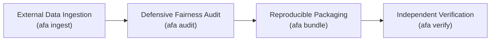
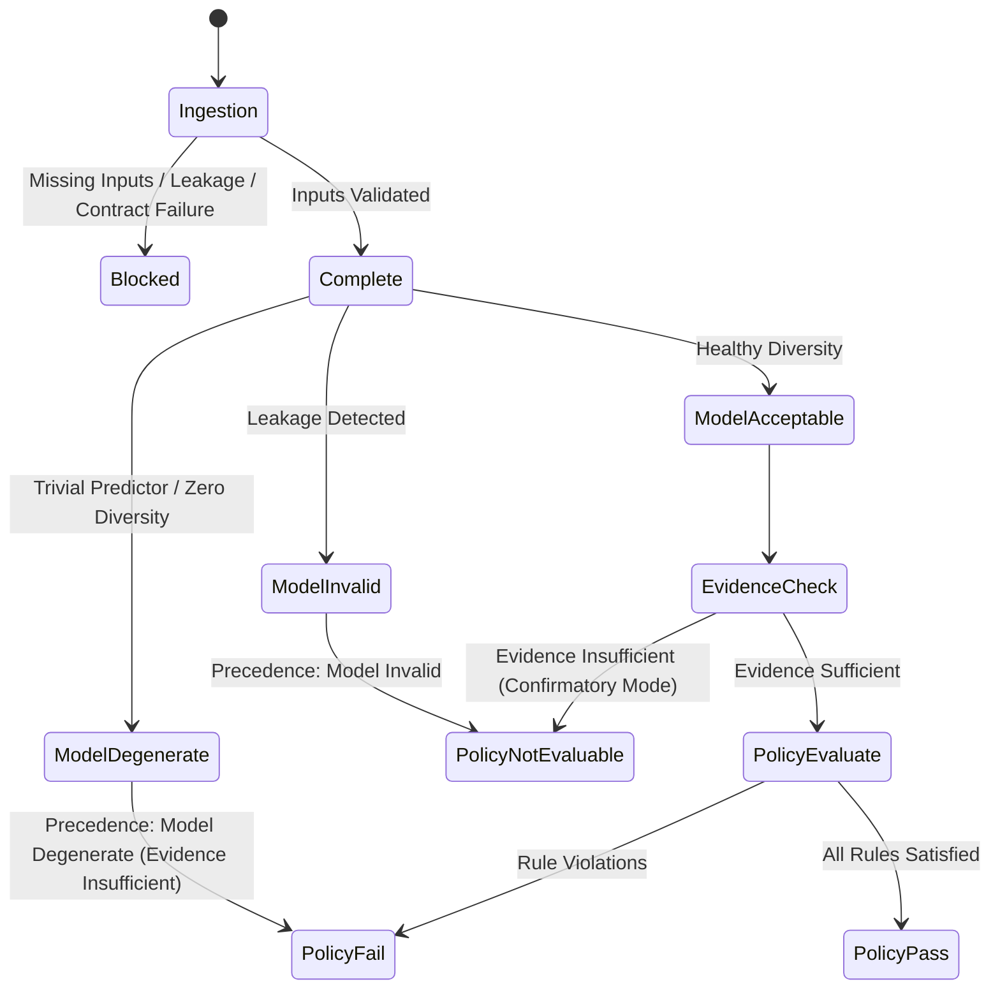

# 🚀 Release Candidate Specification & Commercial Verification Report (Pass 10)

**Framework:** Algorithmic Fairness Analysis (`algorithmic-fairness-analysis`)  
**Release Candidate Version:** `1.0.0-rc1`  
**Governance Standard:** `PASS_10_RELEASE_CANDIDATE`  
**Verification Scope:** Internally verified against the repository's documented engineering and integrity test suite.  
**Audit Date:** September 2026  
**Final Evidence Boundary & Status Statement:**  
> **“Release-candidate engineering verification complete. Repository publication checks passed. External real-data validation has not been executed and remains pending authorized operational-data staging. The system must not be interpreted as providing customer-specific, regulatory, or production suitability conclusions without additional human and empirical validation.”**

**Classification: `RELEASE CANDIDATE — READY FOR PUBLICATION`**
- **Engineering readiness:** `VERIFIED`
- **Reproducibility:** `VERIFIED`
- **Bundle integrity:** `VERIFIED`
- **Publication hygiene:** `VERIFIED`
- **External real-data validation:** `PENDING (EXTERNAL_VALIDATION_PENDING)`
- **Regulatory/business approval:** `HUMAN REVIEW REQUIRED`

---

## 1. Executive Summary & Product Scope

`algorithmic-fairness-analysis` is an audit-grade, defensible fairness evaluation, mitigation, and verification engine designed for machine learning engineers, model risk officers, and external compliance auditors.

### 1.1 Scope Boundaries & Core Mission
- **What the framework IS:**
  - An independent, reproducible verification engine that computes performance, conditional parity metrics, non-parametric bootstrap uncertainty intervals (row and cluster-aware), and multi-policy sensitivity.
  - A governance pipeline enforcing prediction-time feature contracts, group/temporal split isolation, locked-test evaluation firewalls, evaluation unit alignment, estimand specification, and mathematical audit invariants.
  - A packaging system generating self-contained, reproducible evaluation bundles with Draft-07 JSON Schema audit results, canonical SHA-256 fingerprints, and zero inclusion of raw customer or proprietary records.
  - An automated pre-decision evaluability gate (`verify_policy_decision_gate`) that checks whether evaluation conditions meet minimum statistical and integrity prerequisites before confirmatory evaluation.

- **What the framework IS NOT (Critical Boundaries):**
  - **NOT a legal certification:** Technical satisfaction of mathematical criteria (e.g., equalized odds difference $\le 0.10$, disparate impact ratio $\ge 0.80$) demonstrates quantitative compliance with an internal policy. It **DOES NOT** constitute statutory non-discrimination certification under Title VII, ECOA, FHA, the EU AI Act, or other legal doctrines.
  - **NOT an automated lawyer or ethical arbiter:** The platform does not decide whether a sensitive attribute proxy is legally permissible or whether observed disparities are legally justified.
  - **NOT a real-data validator solely through synthetic execution:** Passing synthetic DGP fixtures validates software architecture and mathematical invariants; it **DOES NOT** validate performance, fairness, or feature semantics on authentic operational customer data.

---

## 2. Enterprise Buyer & Compliance Reviewer Workflow



### 2.1 Input Prerequisites
1. **Authenticated Dataset:** Staged in an untracked local directory outside Git tracking, with recorded SHA-256 digest.
2. **Prediction-Time Feature Contract:** Specification of authorized operational features (`configs/benchmark_features.yaml`), strictly excluding post-decision realizations or leaky target proxies.
3. **Evaluation Unit & Estimand Specification:** Formal declaration of observation unit, decision unit, and target population estimand (`configs/evaluation_units.yaml`).
4. **Governing Fairness Policy:** Declared thresholds for balanced accuracy, equalized odds difference, demographic parity difference, calibration error, and minimum bootstrap fraction.

### 2.2 Execution Flow & CLI Subcommands
The framework provides a deterministic command-line interface (`afa`):

1. **Ingest & Validate (`afa ingest`):**
   ```bash
   afa ingest --dataset delhivery_logistics --file /path/to/staged_data.csv
   ```
   Validates observation-to-decision unit mappings, checks column cardinality and null rates, verifies split isolation keys, and generates an `EvaluationManifest`.
   *Exit code: `0` on success, `2` if blocked by validation failure, `4` on configuration error.*

2. **Audit Execution (`afa audit`):**
   ```bash
   afa audit --file /path/to/staged_data.csv --dataset delhivery_logistics --confirmatory --output audit_result.json
   ```
   Trains baselines or evaluates predictions, checks prediction diversity, computes conditional metrics with bootstrap intervals, checks audit invariants, runs the Policy Decision Gate, and maps to the decoupled audit taxonomy.
   *Exit code: `0` on success (policy pass), `1` if policy failed, `2` if execution blocked, `4` on configuration error.*

3. **Reproducible Packaging (`afa bundle`):**
   ```bash
   afa bundle --audit-result audit_result.json --output-dir release_bundle/
   ```
   Assembles a zero-raw-data audit package containing configuration, results, provenance, warnings, environment metadata, and replication README.
   *Exit code: `0` on success, `4` on configuration error.*

4. **Independent Verification (`afa verify`):**
   ```bash
   afa verify release_bundle/
   ```
   Executes independent cryptographic, schema, invariant, and raw-data checks on the bundle.
   *Exit code: `0` if verification succeeds, `3` if verification fails, `4` on path/config error.*

---

## 3. Decision Boundaries: Automated Decisions vs. Human Governance

The framework strictly decouples mathematical evaluation from subjective policy and legal decisions:

| Automated Framework Decisions | Required Human Governance Decisions |
| :--- | :--- |
| Metric calculation (TPR, FPR, TNR, FNR, PPV, balanced accuracy, DPD, EOD, DIR). | Determining whether the evaluated fairness metric aligns with the governing legal standard. |
| Feature leakage detection and prediction-time contract enforcement. | Assessing whether sensitive attribute proxies (e.g., zip code, route complexity) are legally legitimate. |
| Non-parametric bootstrap confidence interval estimation (row & cluster). | Authorizing operational deployment trade-offs between accuracy and demographic parity. |
| Verification of mathematical and count identities ($TP+TN+FP+FN=N$, etc.). | Evaluating whether historical training labels encode systemic societal bias. |
| Enforcement of Policy Decision Gate prerequisites (estimand, split, support). | Final approval of regulatory or legal submission packages. |

### Decoupled Human Review Trigger Codes
When human review is required, the framework emits structured, machine-readable reason codes rather than silently altering statistical results:
- `REVIEW_MATERIAL_POLICY_VIOLATION`: Automated policy conditions failed; human governance review required before deployment.
- `REVIEW_INCONCLUSIVE_EVIDENCE`: Evidence is insufficient or policy is not evaluable; human review required to determine remediation.
- `REVIEW_DERIVED_SENSITIVE_ATTRIBUTE`: Sensitive attribute lineage is derived or imputed proxy; requires legal and demographic review.
- `REVIEW_REGULATORY_MAPPING`: Evaluation uses regulatory mapping thresholds (e.g. EEOC 80% rule); legal compliance review required.
- `REVIEW_LOW_SUPPORT`: Subgroups with insufficient sample support detected.
- `REVIEW_AMBIGUOUS_ESTIMAND`: Statistical estimand is unspecified or ambiguous.
- `REVIEW_FEATURE_TIMING`: Model uses temporal features; requires domain review of cutoff boundaries.
- `REVIEW_UNIT_MISMATCH`: Statistical unit divergence from observational rows requires domain verification.

---

## 4. Cryptographic Fingerprint Threat Model & Disclosure

> [!NOTE]
> **THREAT MODEL SPECIFICATION: WHAT SHA-256 FINGERPRINTS PROVE AND DO NOT PROVE**
>
> 1. **What Cryptographic Fingerprints Establish:**
>    - **Tamper Evidence:** Any post-hoc modification to metrics, sample counts, thresholds, or configuration in `audit_result.json` invalidates the SHA-256 fingerprint.
>    - **Artifact Consistency:** Establishes mathematical agreement between declared configuration manifests and recorded results.
>    - **Independent Verifiability:** Any auditor can independently recompute the canonical digest without access to proprietary training code.
>
> 2. **What Cryptographic Fingerprints DO NOT Establish:**
>    - **Origin Authenticity:** A cryptographic hash does not prove that the original data source was authentic or collected ethically.
>    - **Upstream Manipulation:** A hash does not detect manipulations applied to data *prior* to hashing.
>    - **Legal Truth or Substantive Fairness:** A valid hash confirms that the numbers have not been altered; it does not confirm that the underlying algorithm is non-discriminatory or compliant with law.
>
> In all reports, **cryptographic consistency is strictly distinguished from empirical real-data validation and legal authenticity**.

---

## 5. Status Taxonomy & Precedence Engine

To eliminate ambiguity across schema, code, and documentation, the framework enforces a decoupled four-tier status taxonomy with strict precedence:



### Precedence Rules:
1. **`AUDIT_EXECUTION_STATUS = BLOCKED`** $\implies$ **`POLICY_STATUS = NOT_EVALUABLE`** (`PRECEDENCE_EXECUTION_BLOCKED`).
2. **`MODEL_STATUS = INVALID`** $\implies$ **`POLICY_STATUS = NOT_EVALUABLE`** (`PRECEDENCE_MODEL_INVALID`).
3. **`MODEL_STATUS = DEGENERATE`** $\implies$ **`POLICY_STATUS = FAIL`** and **`EVIDENCE_STATUS = INSUFFICIENT`** (`PRECEDENCE_MODEL_DEGENERATE`).
4. **`EVIDENCE_STATUS = INSUFFICIENT`** $\implies$ **`POLICY_STATUS = NOT_EVALUABLE`** under confirmatory analysis (`PRECEDENCE_EVIDENCE_INSUFFICIENT`).
5. **Confirmatory Mode Gate Failure** (missing estimand, invalid unit, contaminated split) $\implies$ **`POLICY_STATUS = NOT_EVALUABLE`** (`PRECEDENCE_CONFIRMATORY_REQUIREMENTS_UNMET`).

---

## 6. P0 / P1 / P2 Priority Disposition Table

Every capability across Passes 1 through 10 is reconciled below:

| Priority | Feature / Capability | Pass Implemented | Resolution Status | Technical Implementation & Notes |
| :--- | :--- | :---: | :---: | :--- |
| **P0** | **Feature Leakage Prevention** | Pass 1–2 | **RESOLVED** | Prediction-time feature contracts (`configs/benchmark_features.yaml`) prohibiting post-outcome realizations. |
| **P0** | **Anti-Degeneracy Protection** | Pass 3 | **RESOLVED** | `detect_prediction_collapse`, anti-degeneracy gating, majority baseline negative control. |
| **P0** | **Evaluator Independence** | Pass 4 | **RESOLVED** | Standalone evaluator with independent metric computation, zero training code dependencies. |
| **P0** | **Group & Temporal Holdout Isolation**| Pass 2 | **RESOLVED** | Entity/hub group-isolated splitting, chronological progression checks, `LockedTestData` firewall. |
| **P0** | **Zero Raw Customer Data Ingestion** | Pass 5, 9 | **RESOLVED** | Git repository tracked exclusively with synthetic DGPs; zero PII or proprietary customer data stored. |
| **P0** | **Mathematical Audit Invariants** | Pass 9 | **RESOLVED** | Exact count identities ($TP+TN+FP+FN=N$), metric equations, balanced accuracy bounds. |
| **P0** | **Policy Decision Gate** | Pass 9–10 | **RESOLVED** | 9-condition pre-decision evaluability gate (formerly certification gate); blocks confirmatory claims on invalid units. |
| **P1** | **Independent Bundle Verification** | Pass 10 | **RESOLVED** | `verify_audit_bundle()` with 8 independent checks, forged-consistency defenses, and structured failure codes. |
| **P1** | **Decoupled Status Taxonomy** | Pass 10 | **RESOLVED** | Four-tier taxonomy (`AUDIT_EXECUTION_STATUS`, `EVIDENCE_STATUS`, `MODEL_STATUS`, `POLICY_STATUS`) with precedence engine. |
| **P1** | **Human Review Boundary Decoupling** | Pass 10 | **RESOLVED** | `HumanReviewBoundary` with 8 structured reason codes sitting on top of statistical facts without altering results. |
| **P1** | **Broad Raw Data Detection** | Pass 10 | **RESOLVED** | Recursive detection of `.csv`, `.parquet`, `.feather`, `.arrow`, `.h5`, `.sqlite`, `.db`, `.pkl` in bundles. |
| **P1** | **Product-Grade CLI** | Pass 10 | **RESOLVED** | Unified CLI (`afa`) with deterministic exit codes: 0 (Success), 1 (Policy Failed), 2 (Blocked), 3 (Verification Failed), 4 (Config Error). |
| **P1** | **Publication Release Audit** | Pass 10 | **RESOLVED** | `run_publication_release_audit()` checking zero raw datasets, credential patterns, local paths, license, qualified claims. |
| **P1 / Empirical Blocker** | **External Real-Data Field Validation** | Ongoing | **PENDING** | `EXTERNAL_VALIDATION_PENDING`. Execution on live customer clusters pending client staging per `docs/EXTERNAL_VALIDATION_PENDING.md`. See qualification below. |
| **P2** | **Causal DAG Mediation Analysis** | Future | **DEFERRED** | Causal mediation for direct/indirect effect decomposition across sensitive traits. Explicitly out of scope for Pass 10. |
| **P2** | **Active Learning Sampling** | Future | **DEFERRED** | Active query selection for rare subgroup annotation. Out of scope for evaluation engine. |
| **P2** | **Human-in-the-Loop Web Workflow** | Future | **DEFERRED** | Web-based interactive review console for compliance teams. CLI and JSON schema serve as programmatic foundation. |

### Qualification of External Real-Data Validation Status
The absence of external real-data validation is **NOT** classified as a generic P1 without qualification. It is a hard limitation for empirical buyer claims, but not a software artifact release blocker:
- **Release / publication blocker:** **NO** (Software artifact and synthetic verification suite are complete).
- **Engineering verification blocker:** **NO** (Mathematical invariants, schemas, and pipeline mechanics verified).
- **External empirical validation blocker:** **YES** (Hard limitation; empirical accuracy and parity on client operational data have not been measured).
- **Regulatory / business decision blocker:** **YES where applicable** (Cannot be used as the sole basis for statutory compliance or operational deployment without human and empirical review).

`EXTERNAL_VALIDATION_PENDING` remains strictly immutable until genuine operational data is executed through `ExternalDatasetAdapter`.

### Push-Ready vs. Commercially Validated Boundary
- **`SAFE FOR GITHUB PUSH`**: Established strictly based on repository hygiene, absence of tracked raw tabular data, absence of detected secrets, and permissive licensing.
- **`COMMERCIALLY VALIDATED`**: **NOT CLAIMED**. GitHub push readiness must never be interpreted as evidence that the product has been validated on authentic operational customer data. For full claim boundaries, see the Claim Eligibility Matrix in [`docs/FINAL_RELEASE_AUDIT.md`](FINAL_RELEASE_AUDIT.md).

---

## 7. Pre-Publication Release Audit Checklist

Before tagging or distributing release artifacts, the publication audit verifies:

1. [x] **Zero Raw Customer Datasets:** No tracked operational tabular data files (`.parquet`, `.feather`, `.arrow`, `.h5`, `.db`, or `.csv`) exist in Git tracking.
2. [x] **Zero Credentials Detected:** No credential-like material detected by the implemented scanners (`sk-`, `ghp_`, `AKIA`, private keys).
3. [x] **Zero Local Machine Paths:** No absolute developer filesystem paths (`/Users/...`, `C:\Users\...`) detected in scanned public documentation.
4. [x] **Explicit License Declared:** Permissive MIT license declared in `pyproject.toml` and root `LICENSE`.
5. [x] **Evidence-Qualified Language:** No unsupported claims detected under configured claim-audit rules. All statements qualify technical performance and declare:
   > **“Release-candidate engineering verification complete. Repository publication checks passed. External real-data validation has not been executed and remains pending authorized operational-data staging. The system must not be interpreted as providing customer-specific, regulatory, or production suitability conclusions without additional human and empirical validation.”**
