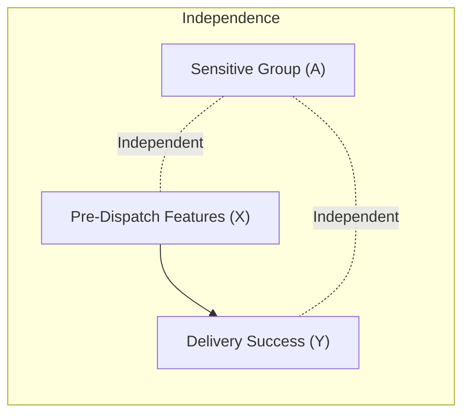
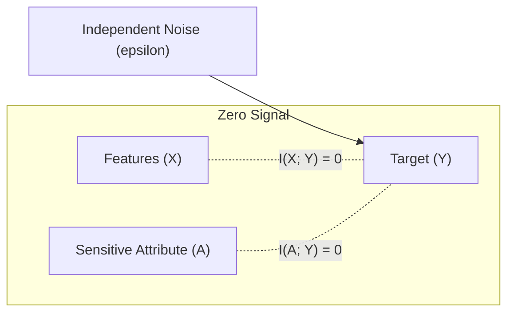

# Synthetic Scenario & Data-Generating Process (DGP) Specification

This document provides the formal structural causal models (SCMs), equations, parameterizations, and methodological boundaries for Scenarios A through E implemented in [`src/canonical_benchmark.py`](../src/canonical_benchmark.py) and configured in [`configs/synthetic_scenarios.yaml`](../configs/synthetic_scenarios.yaml).

---

## 1. Mathematical Architecture of the Base Data-Generating Process

Across all scenarios, the baseline operational covariates represent pre-dispatch logistics planning variables:
- $\text{planned\_distance} \sim \text{Uniform}(5.0, 50.0)$ (km)
- $\text{planned\_time} = \text{planned\_distance} \cdot u_{\text{speed}}$, where $u_{\text{speed}} \sim \text{Uniform}(1.8, 2.4)$ (minutes)
- $\text{stops\_count} \sim \text{DiscreteUniform}(5, 40)$
- $\text{vehicle\_capacity} \sim \text{Uniform}(100.0, 500.0)$ ($m^3$)
- $\text{station\_code} \sim \text{Categorical}(\{\text{HUB\_NORTH}, \text{HUB\_SOUTH}, \text{HUB\_EAST}, \text{HUB\_WEST}, \text{HUB\_CENTRAL}\})$

Features are standardized relative to their theoretical marginal centroids:
$$x_1 = \frac{\text{planned\_distance} - 27.5}{13.0}, \quad x_2 = \frac{\text{planned\_time} - 57.5}{28.0}, \quad x_3 = \frac{\text{stops\_count} - 22.5}{10.0}, \quad x_4 = \frac{\text{vehicle\_capacity} - 300.0}{115.0}$$

The delivery outcome $Y \in \{0, 1\}$ ($1 = \text{Task\_Success}$, delivery completed without deadline cutoff) is determined via the latent logit:
$$z = \beta_0 + \beta_1 x_1 + \beta_2 x_2 + \beta_3 x_3 + \beta_4 x_4 + \gamma A + \epsilon, \quad \epsilon \sim \mathcal{N}(0, \sigma^2)$$
$$P(Y = 1 \mid X, A) = \sigma_{\text{logit}}(z) = \frac{1}{1 + e^{-z}}$$
$$Y = \mathbb{I}(z \ge 0) = \mathbb{I}(P(Y=1 \mid X, A) \ge 0.50)$$

---

## 2. Signal Regimes

| Regime | $\beta_1$ (dist) | $\beta_2$ (time) | $\beta_3$ (stops) | $\beta_4$ (cap) | Noise $\sigma$ | Expected AUC | Base Prevalence |
| :--- | :---: | :---: | :---: | :---: | :---: | :---: | :---: |
| **`LOW_SIGNAL`** | $-0.25$ | $-0.30$ | $-0.20$ | $+0.15$ | $1.50$ | $\approx 0.56 - 0.64$ | $\approx 50\%$ |
| **`MODERATE_SIGNAL`** | $-0.75$ | $-0.80$ | $-0.65$ | $+0.45$ | $1.00$ | $\approx 0.70 - 0.79$ | $\approx 52\%$ |
| **`HIGH_SIGNAL`** | $-1.50$ | $-1.60$ | $-1.20$ | $+0.90$ | $0.60$ | $\approx 0.85 - 0.94$ | $\approx 55\%$ |
| **`ZERO_SIGNAL`** | $0.00$ | $0.00$ | $0.00$ | $0.00$ | $1.00$ | $0.50$ | $\approx 89.4\%$ |

---

## 3. Detailed Scenario Specifications

### Scenario A: `SCENARIO_A_NO_GROUP_EFFECT`

#### Causal Graph

#### Structural Equations
- $A \sim \text{Bernoulli}(0.50)$, where $A \in \{0, 1\}$ ($0 = \text{Standard\_Complexity}, 1 = \text{High\_Complexity}$).
- $\Delta X = 0$ (no shift in covariates).
- $\gamma = 0.0$ (no direct group effect on target).
- $z = 0.1 + \beta^T X + \epsilon$.

#### Properties & Population Targets
- Population Group Rates: $P(Y=1 \mid A=0) = P(Y=1 \mid A=1) \approx 0.584$.
- Population Base Rate Gap: $\Delta P = 0.000$.
- Expected Equalized Odds Difference: $\approx 0.000$ (asymptotic).
- Expected Demographic Parity Difference: $\approx 0.000$ (asymptotic).

#### Qualitative Behavior & Purpose
Evaluates false positive fairness alarms. Any measured empirical disparity at finite $N$ reflects pure statistical sampling noise.

#### What This Scenario Does NOT Prove
Does NOT prove that a mitigation algorithm works; it only tests whether an unmitigated baseline correctly identifies an unbiased environment.

---

### Scenario B: `SCENARIO_B_PREDICTIVE_FEATURE_GROUP_CORRELATION`

#### Causal Graph

*Note: This is a mediated proxy structure ($A \to X \to Y$), NOT reverse confounding ($A \leftarrow X \to Y$) and NOT direct group bias ($A \to Y$).*

#### Structural Equations
- $A \sim \text{Bernoulli}(0.45)$.
- $\text{planned\_distance} \leftarrow \text{planned\_distance} + 15.0 \cdot A$.
- $\text{stops\_count} \leftarrow \text{stops\_count} + 10.0 \cdot A$.
- $\gamma = 0.0$ (conditional on $X$, $A \perp\!\!\!\perp Y \mid X$).
- $z = 0.1 + \beta^T X + \epsilon$.

#### Properties & Population Targets
- Disadvantaged group ($A=1$) receives systematically longer routes and more stops.
- Population Group Rates: $P(Y=1 \mid A=0) \approx 0.652$, $P(Y=1 \mid A=1) \approx 0.441$.
- Population Base Rate Gap: $\Delta P \approx 0.211$.
- Unmitigated Demographic Parity Gap: $\approx 0.12 - 0.15$.
- Unmitigated Equalized Odds Gap: $\approx 0.08 - 0.11$.

#### Qualitative Behavior & Purpose
Tests how algorithms handle legitimate operational differences correlated with group membership. Illustrates the trade-off between demographic parity and predictive calibration: demographic parity forces the classifier to treat disparate difficulty profiles identically.

#### What This Scenario Does NOT Prove
Does NOT prove that group disparities in real enterprise logistics are justified or purely feature-driven; it is an idealized synthetic simulation of feature-mediated disparity.

---

### Scenario C: `SCENARIO_C_EXPLICIT_GROUP_EFFECT` (Canonical Scenario)

#### Causal Graph

*Joint causal architecture: features $X$ and sensitive group $A$ both directly influence outcome $Y$ ($X \to Y \leftarrow A$).*

#### Structural Equations
- $A \sim \text{Bernoulli}(0.50)$.
- Direct causal effect: $\gamma = -1.25$.
- Feature shift: $\Delta \text{distance} = 0$, $\Delta \text{stops} = 0$.
- Latent logit:
  $$z = 0.1 + \beta_1 x_1 + \beta_2 x_2 + \beta_3 x_3 + \beta_4 x_4 - 1.25 A + \epsilon$$

#### Population Theoretical Ground Truth (Monte Carlo $N=200,000$)
- $P(Y=1 \mid A=0) = 0.5841 \pm 0.0011$
- $P(Y=1 \mid A=1) = 0.4048 \pm 0.0011$
- Population Base Rate Gap: $\Delta P = 0.1793$
- Population Disparate Impact Ratio: $0.6930$

#### Qualitative Behavior & Purpose
Serves as the frozen canonical stress test. Group $A=1$ suffers a direct penalty. Tests whether post-processing threshold adjustments (`ThresholdOptimizer`) or in-processing reweighting can eliminate Equalized Odds gaps without destroying predictive accuracy.

#### What This Scenario Does NOT Prove
Does NOT establish real-world discrimination against delivery drivers; the sensitive attribute is synthetic and the penalty is numerically injected.

---

### Scenario D: `SCENARIO_D_SEVERE_FAIRNESS_TRADEOFF`

#### Causal Graph

#### Structural Equations
- $A \sim \text{Bernoulli}(0.50)$.
- High feature shift: $\text{planned\_distance} += 22.0 \cdot A$, $\text{stops\_count} += 18.0 \cdot A$.
- Direct effect: $\gamma = -1.80$.
- Signal regime: `HIGH_SIGNAL` ($\sigma = 0.60$, large coefficients).
- Latent logit:
  $$z = 0.1 - 1.50 x_1 - 1.60 x_2 - 1.20 x_3 + 0.90 x_4 - 1.80 A + \epsilon$$

#### Population Theoretical Ground Truth (Monte Carlo $N=200,000$)
- $P(Y=1 \mid A=0) = 0.7682 \pm 0.0009$
- $P(Y=1 \mid A=1) = 0.1814 \pm 0.0009$
- Population Base Rate Gap: $\Delta P = 0.5868$
- Population Disparate Impact Ratio: $0.2361$

#### Qualitative Behavior & Scientific Boundary
Exposes the acute Pareto frontier between demographic parity and predictive accuracy. Forcing demographic parity ($\text{PPR}_0 = \text{PPR}_1$) requires aggressively misclassifying low-risk $A=0$ instances or high-risk $A=1$ instances.

#### Crucial Claim Qualification: Impossibility vs. Trade-off
> [!IMPORTANT]
> **Why Scenario D is NOT called "Impossible Fairness":**
> Calling a steep trade-off "impossible" is scientifically inaccurate. Randomized or degenerate policies (e.g. constant coin flips) can trivially achieve $\text{EODiff} = 0$ or $\text{DPD} = 0$. However, achieving high demographic parity *simultaneously* with high balanced accuracy is sharply constrained by the underlying distribution. Scenario D tests boundary behavior, not an absolute mathematical impossibility theorem.

---

### Scenario E: `SCENARIO_E_CONSTANT_PREDICTOR` (Negative Control)

#### Causal Graph

#### Structural Equations
- $X$ generated independently.
- $A \sim \text{Bernoulli}(0.50)$ generated independently.
- Target $Y = \mathbb{I}(\epsilon \ge \Phi^{-1}(0.106))$, where $\epsilon \sim \mathcal{N}(0, 1.0)$.
- Positive class prevalence: $P(Y=1) \approx 89.4\%$.
- Mutual information: $I(X; Y) = 0, \quad I(A; Y) = 0$.

#### Qualitative Behavior & Purpose
Replicates the Pass-2 synthetic delivery fixture defect. Because features carry zero predictive signal and the positive class dominates, regularized classifiers collapse to the trivial majority predictor $\hat{Y} \equiv 1$.
- Accurately triggers `ModelDegeneracyStatus.DEGENERATE`.
- Accurately classified as `FairnessSuccessStatus.FAIR_BUT_DEGENERATE` / `PolicyDecision.POLICY_DEGENERATE`.
- Asserts that zero parity gaps obtained via classifier collapse are never certified as compliant.

---

## 4. Summary Matrix of Scenario Characteristics

| Scenario | Causal Mechanism | Signal Regime | Direct $\gamma$ | Covariate Shift | Expected Disparity | Test Focus |
| :--- | :--- | :--- | :---: | :---: | :---: | :--- |
| **A** | Pure Independence | `MODERATE_SIGNAL` | $0.00$ | $0.0$ | $\approx 0$ | False positive fairness alarm trap |
| **B** | Mediated Proxy ($A \to X \to Y$) | `MODERATE_SIGNAL` | $0.00$ | $+15 \text{ km}, +10 \text{ stops}$ | Moderate | Legitimate covariate disparity handling |
| **C** | Joint Effect ($X \to Y \leftarrow A$) | `MODERATE_SIGNAL` | $-1.25$ | $0.0$ | Substantial | Canonical mitigation efficacy |
| **D** | Severe Shift + Penalty | `HIGH_SIGNAL` | $-1.80$ | $+22 \text{ km}, +18 \text{ stops}$ | Severe | Pareto boundary & steep utility loss |
| **E** | Zero Mutual Info ($I=0$) | `ZERO_SIGNAL` | $0.00$ | $0.0$ | Trivial ($0$) | Anti-degeneracy & collapse tripwire |
