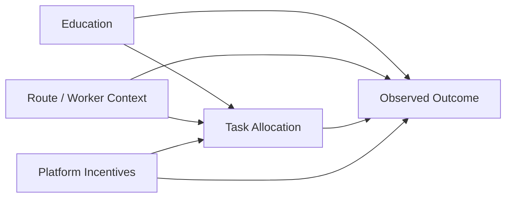

# Final Evaluation Results and Research Appendix

_Generated on 2026-09-10 19:08:27_

## What this report adds
- Reweighting-based fairness intervention
- Predictive parity and subgroup fairness checks
- Causal-style counterfactual analysis on education intervention
- Robustness checks on unseen holdouts and time splits
- Updated labor-economics interpretation and welfare-loss framing

## Fairness metric definitions
- Demographic parity difference: $|P(\hat{Y}=1|A=a) - P(\hat{Y}=1|A=b)|$
- Equal opportunity difference: $|P(\hat{Y}=1|Y=1,A=a) - P(\hat{Y}=1|Y=1,A=b)|$
- Equalized odds difference: maximum of the TPR and FPR gaps across groups
- Predictive parity difference: gap in positive predictive value across groups
- Disparate impact ratio: ratio of positive prediction rates, closer to 1 is better

## Causal graph

## Labor economics interpretation & Methodological Caveats
In observational logistics and algorithmic dispatch settings, proxy attributes correlate with route difficulty, schedule timing, and geography. Observed disparities can reflect underlying task allocation patterns, model sensitivity, or feature-to-attribute coupling. For datasets where the sensitive attribute is synthetic, fairness metrics reflect model sensitivity to the synthetic proxy rather than proven demographic discrimination. Reported results reflect out-of-sample evaluation under our split hierarchy.

## Synthetic Logistics Benchmark

- Sensitive Attribute: Complexity_Group
- Sensitive Source: Synthetic group proxy (simulation)
- Notes: Clean benchmark dataset without post-outcome execution leakage features.

### Model comparison (Locked Holdout Test)
| Model | Accuracy | Balanced Accuracy | Fairness Gap | Predictive Parity Diff | DI Ratio |
|---|---:|---:|---:|---:|---:|
| Logistic Regression | 0.5250 | 0.5149 | 0.1437 | 0.0323 | 0.7332 |
| Reweighted Logistic | 0.8400 | 0.5000 | 0.0135 | 0.0541 | 1.0000 |
| Random Forest | 0.8400 | 0.5063 | 0.0287 | 0.0581 | 0.9895 |
| Neural Network | 0.8000 | 0.4825 | 0.0220 | 0.0526 | 0.9942 |
| Weighted XGB | 0.8300 | 0.5004 | 0.0267 | 0.0601 | 0.9985 |
| Equalized Odds ThresholdOptimizer | 0.8400 | 0.5126 | 0.0227 | 0.0535 | 0.9889 |

### Best model (Selected via Validation Set): Reweighted Logistic
- User utility score (alpha=0.25): 0.4966
- Accuracy tradeoff proxy: 0.0000

### Robustness checks
| Check | Dataset | Baseline Accuracy | Mitigated Accuracy | Baseline Fairness Gap | Mitigated Fairness Gap |
|---|---|---|---|---|---|
| Unseen Holdout | Synthetic Logistics Benchmark | 0.5250 | 0.8400 | 0.1437 | 0.0135 |

### Subgroup fairness: Group Tiers
| Subgroup | Value | Count | Accuracy | Positive Rate |
|---|---|---|---|---|
| Group | High_Complexity | 210 | 0.8143 | 1.0000 |
| Group | Standard_Complexity | 190 | 0.8684 | 1.0000 |
