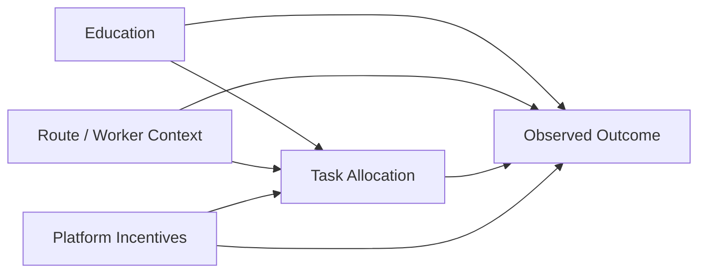

# Final Evaluation Results and Research Appendix

_Generated on 2026-05-04 19:53:16_

## What this report adds
- Reweighting-based fairness intervention
- Predictive parity and subgroup fairness checks
- Causal-style counterfactual analysis on education intervention
- Robustness checks on unseen holdouts and time splits
- Updated labor-economics interpretation and welfare-loss framing

## Fairness metric definitions
- Demographic parity difference: $|P(\hat{Y}=1|A=a) - P(\hat{Y}=1|A=b)|$
- Equal opportunity difference: $|P(\hat{Y}=1|Y=1,A=a) - P(\hat{Y}=1|Y=1,A=b)|$
- Equalized odds difference: maximum of the TPR and FPR gaps across groups
- Predictive parity difference: gap in positive predictive value across groups
- Disparate impact ratio: ratio of positive prediction rates, closer to 1 is better

## Causal graph

## Labor economics interpretation
Education can act as a signaling variable, and platform assignment systems may amplify statistical discrimination when proxies correlate with route difficulty, timing, or geography. The added causal-style and robustness checks help distinguish whether observed disparities are due to model behavior, data structure, or underlying task allocation patterns.

## Delhivery Logistics

- Sensitive Attribute: Education_Level
- Sensitive Source: Synthetic (data-driven proxy)
- Notes: Primary logistics dataset with enhanced features.

### Model comparison
| Model | Accuracy | Balanced Accuracy | Fairness Gap | Predictive Parity Diff | DI Ratio |
|---|---:|---:|---:|---:|---:|
| Logistic Regression | 0.7231 | 0.7558 | 0.0764 | 0.0151 | 0.7103 |
| Reweighted Logistic | 0.8650 | 0.6542 | 0.0347 | 0.0236 | 0.6669 |
| Random Forest | 0.9744 | 0.9472 | 0.0182 | 0.0242 | 0.7653 |
| Neural Network | 0.9305 | 0.8750 | 0.0330 | 0.0239 | 0.7415 |
| Weighted XGB | 0.9391 | 0.9374 | 0.0272 | 0.0445 | 0.7933 |
| Tuned XGB (HPO) | 0.9754 | 0.9679 | 0.0200 | 0.0223 | 0.7704 |
| Equalized Odds ThresholdOptimizer | 0.8620 | 0.7184 | 0.0287 | 0.0626 | 0.8046 |

### Best model: Tuned XGB (HPO)
- Composite score: 0.9629
- Welfare loss proxy: 0.0000

### Robustness checks
| Check | Dataset | Baseline Accuracy | Mitigated Accuracy | Baseline Fairness Gap | Mitigated Fairness Gap |
|---|---|---|---|---|---|
| Unseen Holdout | Delhivery Logistics | 0.7231 | 0.8650 | 0.0764 | 0.0347 |

### Subgroup fairness: Education Tiers
| Subgroup | Value | Count | Accuracy | Positive Rate |
|---|---|---|---|---|
| Education | Bachelor's | 6355 | 0.9736 | 0.1862 |
| Education | High School | 5097 | 0.9786 | 0.1544 |
| Education | Master's | 17522 | 0.9751 | 0.2004 |

### Subgroup fairness: Experience Levels
| Subgroup | Value | Count | Accuracy | Positive Rate |
|---|---|---|---|---|
| Experience | High | 7244 | 0.9569 | 0.3417 |
| Experience | Low | 7244 | 0.9855 | 0.0995 |
| Experience | Mid-High | 7243 | 0.9731 | 0.1940 |
| Experience | Mid-Low | 7243 | 0.9859 | 0.1216 |

### Subgroup fairness: Geography Proxies
| Subgroup | Value | Count | Accuracy | Positive Rate |
|---|---|---|---|---|
| Geography | Far | 7243 | 0.9776 | 0.1550 |
| Geography | Moderate | 7243 | 0.9504 | 0.3541 |
| Geography | Near | 7244 | 0.9818 | 0.2051 |
| Geography | Very Far | 7244 | 0.9916 | 0.0425 |

## Adult Income Benchmark

- Sensitive Attribute: Education_Group
- Sensitive Source: Real attribute (observed education)
- Notes: Real-world fairness benchmark with enhanced features.

### Model comparison
| Model | Accuracy | Balanced Accuracy | Fairness Gap | Predictive Parity Diff | DI Ratio |
|---|---:|---:|---:|---:|---:|
| Logistic Regression | 0.7726 | 0.8019 | 0.1453 | 0.3507 | 0.6410 |
| Reweighted Logistic | 0.8312 | 0.7363 | 0.2070 | 0.2853 | 0.3781 |
| Random Forest | 0.8468 | 0.7685 | 0.1969 | 0.2126 | 0.3514 |
| Neural Network | 0.8313 | 0.7413 | 0.2394 | 0.2248 | 0.3127 |
| Weighted XGB | 0.8057 | 0.8245 | 0.1447 | 0.3367 | 0.5987 |
| Tuned XGB (HPO) | 0.8035 | 0.8227 | 0.1439 | 0.3392 | 0.5992 |
| Equalized Odds ThresholdOptimizer | 0.8163 | 0.7267 | 0.1215 | 0.3212 | 0.5531 |

### Best model: Weighted XGB
- Composite score: 0.7883
- Welfare loss proxy: 0.0000

### Counterfactual / causal-style estimates
| Causal Estimate | Value |
|---|---|
| G-computation ATE | 0.1313 |
| Group-specific HigherEd effect | 0.1343 |
| IPW ATE | 0.1305 |
| Matched Difference | 0.1464 |

### Robustness checks
| Check | Dataset | Baseline Accuracy | Mitigated Accuracy | Baseline Fairness Gap | Mitigated Fairness Gap |
|---|---|---|---|---|---|
| Unseen Holdout | Adult Income Benchmark | 0.7726 | 0.8312 | 0.1453 | 0.2070 |

### Subgroup fairness: Education Tiers
| Subgroup | Value | Count | Accuracy | Positive Rate |
|---|---|---|---|---|
| Education | HigherEd | 2247 | 0.8153 | 0.5349 |
| Education | NonHigherEd | 6798 | 0.8026 | 0.3202 |

### Subgroup fairness: Experience Levels
| Subgroup | Value | Count | Accuracy | Positive Rate |
|---|---|---|---|---|
| Experience | Early | 1736 | 0.9798 | 0.0109 |
| Experience | Late | 2631 | 0.7434 | 0.5728 |
| Experience | Mid | 3600 | 0.7878 | 0.3714 |
| Experience | Senior | 1078 | 0.7375 | 0.4787 |

### Subgroup fairness: Geography Proxies
| Subgroup | Value | Count | Accuracy | Positive Rate |
|---|---|---|---|---|
| Geography | Canada | 37 | 0.8919 | 0.4054 |
| Geography | India | 36 | 0.6389 | 0.6111 |
| Geography | Mexico | 173 | 0.9538 | 0.0520 |
| Geography | Other | 469 | 0.8060 | 0.3028 |
| Geography | Philippines | 58 | 0.8793 | 0.3276 |
| Geography | United-States | 8272 | 0.8025 | 0.3835 |

## Amazon Last-Mile Routes

- Sensitive Attribute: Education_Level
- Sensitive Source: Synthetic (data-driven proxy)
- Notes: Amazon routes included in the full dataset evaluation.

### Model comparison
| Model | Accuracy | Balanced Accuracy | Fairness Gap | Predictive Parity Diff | DI Ratio |
|---|---:|---:|---:|---:|---:|
| Logistic Regression | 0.6288 | 0.6211 | 0.0699 | 0.0260 | 0.8190 |
| Reweighted Logistic | 0.6271 | 0.6063 | 0.0793 | 0.0747 | 0.7888 |
| Random Forest | 0.6656 | 0.6488 | 0.1154 | 0.0704 | 0.6507 |
| Neural Network | 0.6410 | 0.6285 | 0.1063 | 0.0897 | 0.7123 |
| Weighted XGB | 0.6476 | 0.6379 | 0.0945 | 0.0607 | 0.7432 |
| Tuned XGB (HPO) | 0.6541 | 0.6476 | 0.0904 | 0.0770 | 0.7743 |
| Equalized Odds ThresholdOptimizer | 0.6149 | 0.5987 | 0.0651 | 0.0375 | 0.8714 |

### Best model: Tuned XGB (HPO)
- Composite score: 0.6250
- Welfare loss proxy: 0.0000

### Robustness checks
| Check | Dataset | Baseline Accuracy | Mitigated Accuracy | Baseline Fairness Gap | Mitigated Fairness Gap |
|---|---|---|---|---|---|
| Unseen Holdout | Amazon Last-Mile Routes | 0.6288 | 0.6271 | 0.0699 | 0.0793 |
| Time Split (Early) | Amazon Last-Mile Routes | 0.6460 | 0.6476 | 0.0755 | 0.0640 |
| Time Split (Late) | Amazon Last-Mile Routes | 0.6115 | 0.6066 | 0.0758 | 0.0751 |

### Subgroup fairness: Education Tiers
| Subgroup | Value | Count | Accuracy | Positive Rate |
|---|---|---|---|---|
| Education | Bachelor's | 276 | 0.6630 | 0.4058 |
| Education | High School | 222 | 0.6937 | 0.3514 |
| Education | Master's | 725 | 0.6386 | 0.4538 |

### Subgroup fairness: Experience Levels
| Subgroup | Value | Count | Accuracy | Positive Rate |
|---|---|---|---|---|
| Experience | Afternoon | 1065 | 0.6460 | 0.4554 |
| Experience | Morning | 158 | 0.7089 | 0.2152 |

### Subgroup fairness: Geography Proxies
| Subgroup | Value | Count | Accuracy | Positive Rate |
|---|---|---|---|---|
| Geography | DBO3 | 122 | 0.7541 | 0.1639 |
| Geography | DLA7 | 227 | 0.5991 | 0.3304 |
| Geography | DLA9 | 141 | 0.6241 | 0.5957 |
| Geography | DSE4 | 88 | 0.6591 | 0.6477 |
| Geography | DSE5 | 106 | 0.6792 | 0.4528 |
| Geography | Other | 539 | 0.6568 | 0.4360 |
