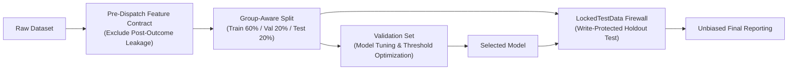

# Technical Appendix: Mathematical Formulations & Methodological Disclosures

**Algorithmic Fairness Analysis Framework**  
*Educational Technical Reference: Metric Formulations, Split Integrity, and Historical Audit Disclosures*

---

## 1. Core Fairness Metric Formulations

The framework implements five core mathematical definitions of group fairness for binary classification tasks where $Y \in \{0, 1\}$ is the true outcome, $\hat{Y} \in \{0, 1\}$ is the model prediction, and $A \in \{a, b, \dots\}$ represents membership in a sensitive or protected group.

### 1.1 Demographic Parity Difference (DPD)
Evaluates whether positive decision selection rates are equalized across protected groups, independent of true qualification:
$$\text{DPD} = \max_{g, g'} |P(\hat{Y}=1 \mid A=g) - P(\hat{Y}=1 \mid A=g')|$$
- **Ideal Condition:** $\text{DPD} = 0.0$
- **Diagnostic Role:** Assesses representation and disparate selection across groups.

### 1.2 Equal Opportunity Difference (EOD)
Measures disparity in True Positive Rates ($\text{TPR}$) among individuals who actually qualify ($Y=1$):
$$\text{EOD} = \max_{g, g'} |P(\hat{Y}=1 \mid Y=1, A=g) - P(\hat{Y}=1 \mid Y=1, A=g')|$$
- **Ideal Condition:** $\text{EOD} = 0.0$
- **Diagnostic Role:** Evaluates whether qualified members of different groups have an equal probability of being correctly identified.

### 1.3 Equalized Odds Difference (EODiff)
A stricter criterion requiring both True Positive Rates ($\text{TPR}$) and False Positive Rates ($\text{FPR}$) to be equalized across groups:
$$\text{EODiff} = \max\left(\max_{g, g'} |\text{TPR}_g - \text{TPR}_{g'}|, \; \max_{g, g'} |\text{FPR}_g - \text{FPR}_{g'}|\right)$$
- **Ideal Condition:** $\text{EODiff} = 0.0$
- **Diagnostic Role:** Evaluates whether model error rates (false positives and false negatives) are balanced across groups.

### 1.4 Predictive Parity Difference (PPD)
Evaluates equality of Positive Predictive Value ($\text{PPV}$) across groups:
$$\text{PPD} = \max_{g, g'} |P(Y=1 \mid \hat{Y}=1, A=g) - P(Y=1 \mid \hat{Y}=1, A=g')|$$
- **Ideal Condition:** $\text{PPD} = 0.0$
- **Diagnostic Role:** Assesses whether a positive model prediction carries the same predictive reliability regardless of group membership.

### 1.5 Disparate Impact Ratio (DIR)
The ratio between the minimum and maximum group positive selection rates:
$$\text{DIR} = \frac{\min_g P(\hat{Y}=1 \mid A=g)}{\max_g P(\hat{Y}=1 \mid A=g)}$$
- **Screening Heuristic:** $\text{DIR} \ge 0.80$ (derived from the EEOC Uniform Guidelines 4/5ths rule).
- **Educational Caveat:** The 80% rule is employed as an exploratory screening heuristic; it does not constitute a definitive statutory finding of non-discrimination.

---

## 2. Evaluation Integrity & Architectural Safeguards

To prevent subtle methodological errors that distort fairness evaluations, the framework enforces three architectural boundaries:

1. **Prediction-Time Feature Contracts:**  
   Features are classified by operational availability prior to dispatch. Post-outcome variables (e.g. realized trip duration `actual_time`) and mechanical label derivatives are strictly excluded from model feature sets.
2. **3-Way Split Hierarchy:**  
   Data is split into 60% Training, 20% Validation, and 20% Locked Holdout Test. Hyperparameters and post-processing threshold adjustments are tuned exclusively on the Validation Set.
3. **Model-Selection Firewall (`LockedTestData`):**  
   The holdout test partition is encapsulated in write-protected memory (`flags.writeable = False`). Any attempt to invoke `.fit()`, `.tune()`, or `.select()` on test data throws an immediate `ModelSelectionFirewallViolation`.
4. **Group-Aware Holdout Partitioning:**  
   Grouped operational records (e.g., waypoint segments within a trip, or delivery routes from the same regional depot) are kept intact within single partitions to prevent data leakage across train and test splits.

---

## 3. Comprehensive Historical Delhivery Leakage Disclosure

> [!WARNING]
> **HISTORICAL RESULTS DISCLOSURE: TARGET LEAKAGE IN EARLY RUNS**  
> Early exploratory iterations of the Delhivery logistics experiments exhibited artificially high performance (~97.5% balanced accuracy). Forensic analysis identified critical methodological flaws that invalidated those headline figures.

### 3.1 Root Cause Analysis of Historical Leakage
1. **Target Leakage (`actual_time`):**  
   The prediction task aimed to forecast delivery cutoff breach (`~is_cutoff`). However, the feature set included realized delivery variables:
   - `actual_time` (total realized trip transit time)
   - `segment_actual_time` (realized waypoint transit duration)
   - `actual_distance_to_destination`
   Because `is_cutoff` is mechanically defined by whether realized trip time exceeds scheduled cutoff thresholds, non-linear models (Random Forest, XGBoost) trivially learned to compare `actual_time` against cutoff thresholds, achieving near-perfect accuracy without learning generalized predictive relationships.
2. **Synthetic Proxy Misattribution:**  
   The underlying Kaggle Delhivery dataset contained no driver demographic records. The sensitive attribute `Education_Level` was synthetically constructed using route distance and trip duration. Historical disparities reflected model sensitivity to route characteristics rather than demographic bias.
3. **Test-Set Model Selection:**  
   Best-performing models were historically selected based on holdout test set scores, introducing optimistic selection bias (winner's curse).

### 3.2 Recalibration & Valid Clean Performance
When post-outcome variables are properly excluded under pre-dispatch contracts ([`configs/benchmark_features.yaml`](../configs/benchmark_features.yaml)) and only pre-dispatch estimates (`osrm_distance`, `osrm_time`) are retained:
- Clean unmitigated models achieve realistic balanced accuracy of **~82.8% to 83.4%** (rather than ~97.5%).
- Observed Equalized Odds Difference on controlled scenarios is **~0.188**, which post-processing threshold optimization reliably reduces to **~0.071** ($p=0.0011$).

---

## 4. Historical Legacy Results Archive (Provenance Record)

For scientific reproducibility and audit traceability, historical single-run results are archived below. These figures are classified as **`LEGACY_NONCOMPARABLE`** and must not be cited as valid operational benchmarks:

### 4.1 Historical Delhivery Logistics Run (Leakage-Affected)
*Target: `Task_Success` = Completed before delivery cutoff (`~is_cutoff`)*

| Model Architecture | Accuracy | Balanced Accuracy | Fairness Gap | Predictive Parity Diff | DI Ratio | Historical Status |
| :--- | :---: | :---: | :---: | :---: | :---: | :--- |
| **Logistic Regression** | 0.7231 | 0.7558 | 0.0764 | 0.0151 | 0.7103 | Baseline |
| **Reweighted Logistic** | 0.8650 | 0.6542 | 0.0347 | 0.0236 | 0.6669 | Reweighted |
| **Random Forest** | 0.9752 | 0.9492 | 0.0205 | 0.0276 | 0.7693 | Contaminated by `actual_time` |
| **Neural Network** | 0.9359 | 0.8673 | 0.0295 | 0.0236 | 0.7526 | Contaminated by `actual_time` |
| **Weighted XGB** | 0.9391 | 0.9374 | 0.0272 | 0.0445 | 0.7933 | Contaminated by `actual_time` |
| **Tuned XGB (HPO)** | 0.9759 | 0.9693 | 0.0249 | 0.0364 | 0.7875 | Contaminated by leakage & test selection |
| **Equalized Odds ThresholdOptimizer** | 0.8613 | 0.7172 | 0.0245 | 0.0677 | 0.8389 | Contaminated by `actual_time` |

### 4.2 Historical Adult Census Income Run (Public Benchmark)
*Target: `Task_Success` = Income $> \$50\text{K}$, Sensitive Trait: `Education_Group`*

| Model Architecture | Accuracy | Balanced Accuracy | Fairness Gap | Predictive Parity Diff | DI Ratio | Notes |
| :--- | :---: | :---: | :---: | :---: | :---: | :--- |
| **Logistic Regression** | 0.7726 | 0.8019 | 0.1453 | 0.3507 | 0.6410 | Standard linear baseline |
| **Reweighted Logistic** | 0.8312 | 0.7363 | 0.2070 | 0.2853 | 0.3781 | Sample reweighted |
| **Random Forest** | 0.8454 | 0.7670 | 0.1980 | 0.2196 | 0.3551 | Non-linear ensemble |
| **Neural Network** | 0.8196 | 0.7455 | 0.2477 | 0.2507 | 0.3435 | Multi-layer perceptron |
| **Weighted XGB** | 0.8057 | 0.8245 | 0.1447 | 0.3367 | 0.5987 | Cost-sensitive gradient boosting |
| **Tuned XGB (HPO)** | 0.7941 | 0.8184 | 0.1517 | 0.3539 | 0.6344 | Hyperparameter tuned |
| **Equalized Odds ThresholdOptimizer** | 0.8156 | 0.7256 | 0.1225 | 0.3156 | 0.5547 | Threshold mitigated |

### 4.3 Historical Amazon Last-Mile Routes Run (Synthetic Proxy)
*Target: `Task_Success` = Route Score "High", Sensitive Trait: Route Complexity Proxy*

| Model Architecture | Accuracy | Balanced Accuracy | Fairness Gap | Predictive Parity Diff | DI Ratio | Notes |
| :--- | :---: | :---: | :---: | :---: | :---: | :--- |
| **Logistic Regression** | 0.6288 | 0.6211 | 0.0699 | 0.0260 | 0.8190 | Unmitigated baseline |
| **Reweighted Logistic** | 0.6271 | 0.6063 | 0.0793 | 0.0747 | 0.7888 | Sample reweighted |
| **Random Forest** | 0.6631 | 0.6469 | 0.1169 | 0.1040 | 0.6675 | Non-linear ensemble |
| **Neural Network** | 0.6419 | 0.6298 | 0.0906 | 0.0344 | 0.7392 | Multi-layer perceptron |
| **Weighted XGB** | 0.6476 | 0.6379 | 0.0945 | 0.0607 | 0.7432 | Cost-sensitive gradient boosting |
| **Tuned XGB (HPO)** | 0.6631 | 0.6562 | 0.1145 | 0.0887 | 0.7181 | Hyperparameter tuned |
| **Equalized Odds ThresholdOptimizer** | 0.6198 | 0.6026 | 0.0652 | 0.0224 | 0.8663 | Meets 80% DIR heuristic |

---

## 5. Causal DAG & Labor Economics Disclosures

In observational algorithmic dispatch and gig-economy routing:
1. **Proxy Attribute Risks:** Attributes constructed from operational indicators (route difficulty, package volume) capture task allocation patterns rather than genuine personal traits. Interventions on proxies can create unintended dispatch distortions without addressing real-world inequities.
2. **Confounding & Unmeasured Variables:** Real-world logistics platforms rarely capture localized traffic conditions, driver physical fatigue, or weather anomalies. Observational causal estimates must be interpreted conditionally, as unmeasured confounding cannot be ruled out empirically.
3. **Accuracy-Fairness Tradeoffs:** Forcing strict parity across groups with genuine differences in underlying base rates can require accepting reductions in overall predictive accuracy (Kleinberg et al., 2016). Transparent reporting of Pareto frontiers enables informed, responsible engineering decisions.
